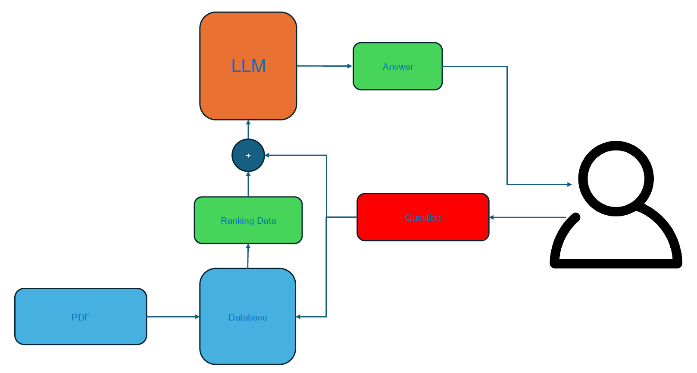
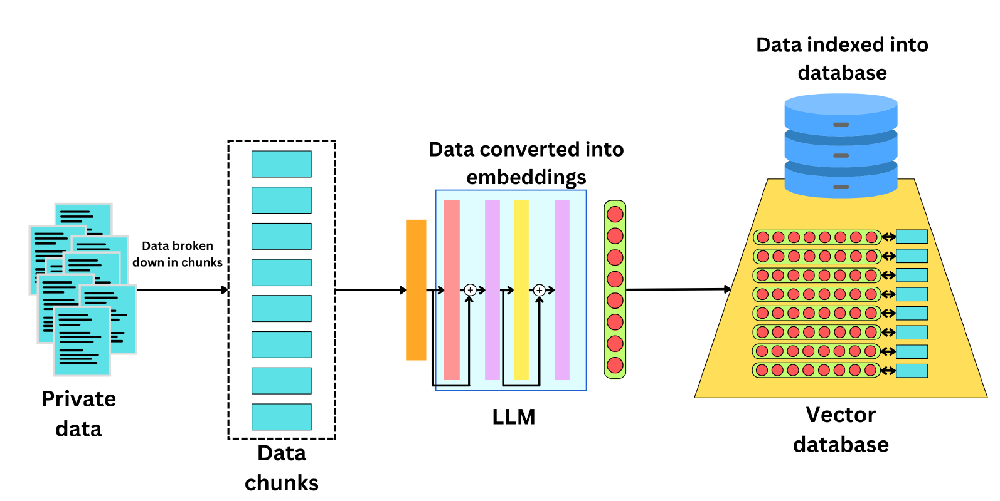
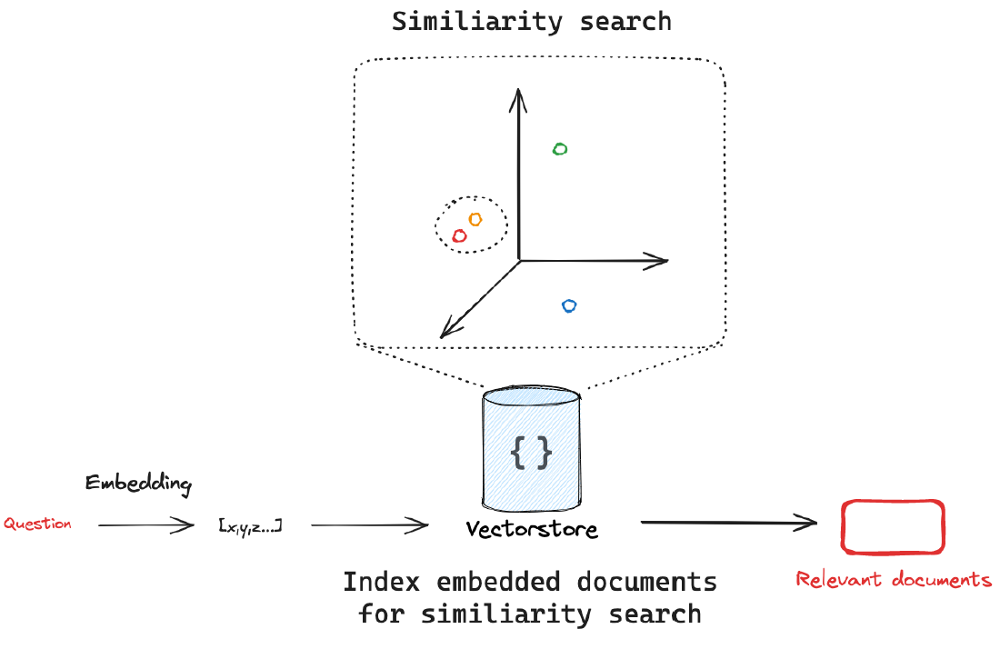
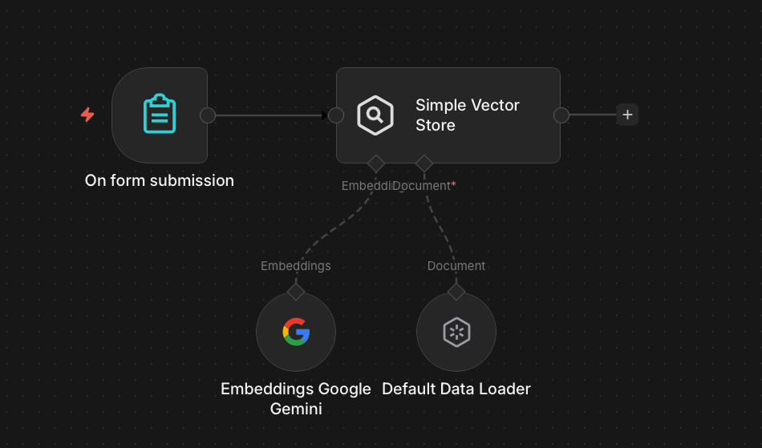
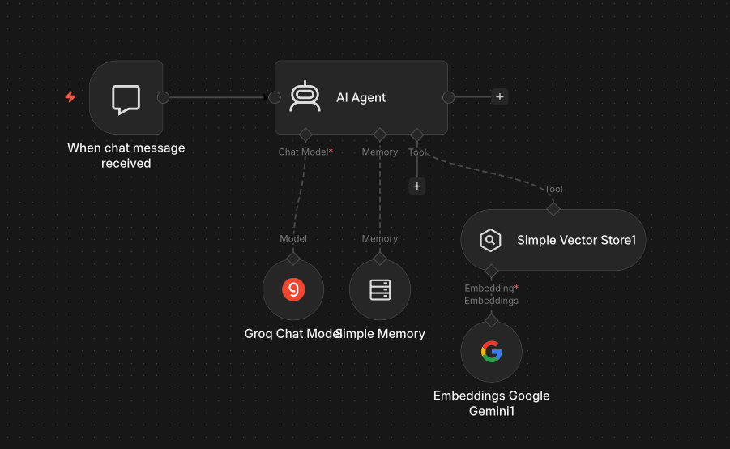
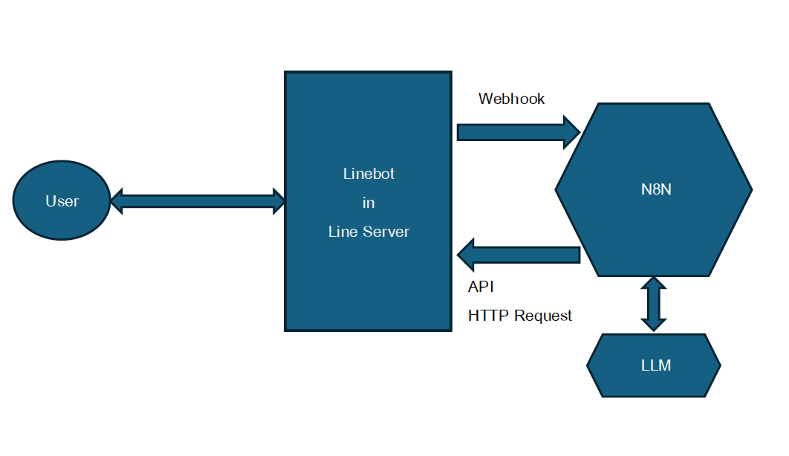
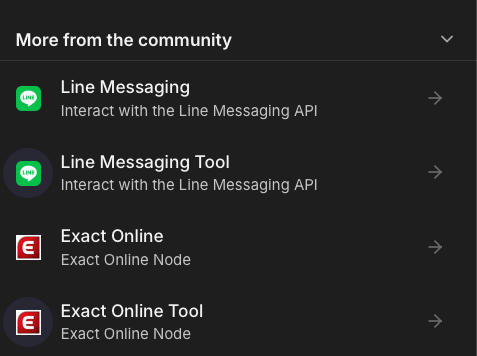
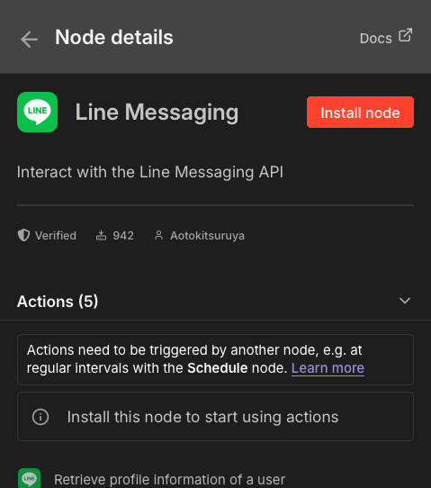
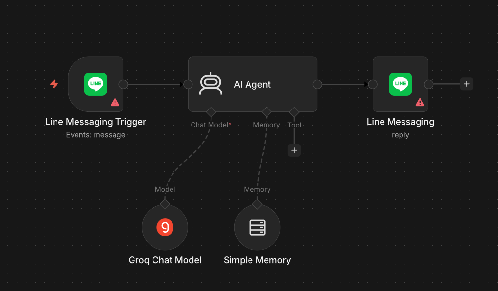

<!-- _class: lead -->

<style scoped>
.logo-bar { position: absolute; top: 36px; right: 64px; display: flex; align-items: center; gap: 16px; }
.logo-bar img { width: 100px; height: 100px; object-fit: contain; }
</style>

<div class="logo-bar">
  
  
</div>

# Workshop: Basic AI Agent on n8n

<div class="subtitle">Module 7 — สร้าง AI Agent และ Agent with Tools บน n8n</div>

**หลักสูตร** การสร้างผู้ช่วยอัจฉริยะ (AI Agent) สำหรับงานสถิติภาครัฐด้วย n8n

ผศ. ดร.ทวีศักดิ์ สมานชื่น
CBTU · คณะวิศวกรรมศาสตร์ · มหาวิทยาลัยมหิดล


---

## ทบทวน Day 1


| Module | หัวข้อ |
|---|---|
| **Module 1** | Introduction AI and Workflow Automation |
| **Module 2** | Introduction to n8n |
| **Module 3** | Workshop: Basic Workflow — Data Table & Google Sheets |
| **Module 4** | Workshop: Statistics Data Pipeline |
| **Module 5** | Workshop: Sentiment Analysis & Satisfaction (100 ชุด) |
| **Module 6** | Encryption Sensitive Data |

### Day 2 Focus

**AI Agent** — Introduction to AI Agent + วิเคราะห์ข้อมูลสถิติจริง + ใช้งานในหน่วยงาน

---

## วัตถุประสงค์การเรียนรู้

เมื่อจบ module นี้ ผู้เรียนสามารถ:

1. **อธิบาย** ความแตกต่างระหว่าง AI Workflow กับ AI Agent
2. **สร้าง** Basic AI Agent บน n8n ด้วย AI Agent Node
3. **เชื่อมต่อ** Memory เพื่อให้ Agent จำบริบทการสนทนา
4. **เพิ่ม Tools** ให้ Agent เรียกใช้ข้อมูลและ Workflow ได้
5. **ทดสอบ** Agent ผ่าน Chat UI และ Webhook

---

## เนื้อหาใน Module นี้

1. **AI Agent คืออะไร?** — Agent vs Workflow
2. **n8n AI Agent Architecture** — Nodes และ Components
3. **Workshop Lab A:** Basic AI Agent พร้อม Memory
4. **Workshop Lab B:** AI Agent with Tools — เชื่อมต่อเครื่องมือจริง
5. **ทดสอบและ Debug** — ตรวจสอบการทำงานของ Agent

---

<!-- _class: divider -->

## 01
## AI Agent คืออะไร?

From Workflow to Autonomous Agent

---

## Workflow vs AI Agent

### ความแตกต่างสำคัญ

| | **Workflow** | **AI Agent** |
|---|---|---|
| **การทำงาน** | ทำตามขั้นตอนตายตัว | ตัดสินใจเองได้ |
| **Input** | ข้อมูลมีโครงสร้าง | คำถาม / คำสั่งภาษาธรรมชาติ |
| **Output** | ผลลัพธ์กำหนดล่วงหน้า | ตอบสนองตามสถานการณ์ |
| **Tools** | ไม่มี | เรียกใช้ Tool เองได้ |
| **Memory** | ไม่มี | จำบริบทได้ |

---
### AI Agent คือ

> Workflow ที่มี LLM เป็น "สมอง" ตัดสินใจเองว่าจะทำขั้นตอนใด ด้วยเครื่องมืออะไร

---

## ReAct Pattern: วิธีคิดของ AI Agent

### Reasoning + Acting Loop

```
[คำถามจากผู้ใช้]-> [Reasoning: LLM คิดว่าต้องทำอะไร] -> [Action: เรียกใช้ Tool ที่เลือก]->
[Observation: ดูผลลัพธ์จาก Tool]->[Reasoning: พอแล้วหรือต้องทำต่อ?]->[Final Answer: ตอบผู้ใช้]
```

### ตัวอย่าง
- "สถิติการจ้างงานเดือนล่าสุดเป็นเท่าไหร่?" → Agent เรียก API → คำนวณ → ตอบ

---

## n8n AI Agent Architecture

### ส่วนประกอบหลักของ AI Agent บน n8n

| Component | n8n Node | หน้าที่ |
|---|---|---|
| **Brain (LLM)** | OpenAI / Anthropic Node | ตัดสินใจและสร้างคำตอบ |
| **Memory** | Window Buffer Memory | จำบริบทการสนทนา |
| **Tools** | Custom n8n Workflows | ดึงข้อมูล / ทำงานจริง |
| **Trigger** | Chat Trigger / Webhook | รับ Input จากผู้ใช้ |

---
## AI Agent n8n Workflow

<div class="center">


</div>

---


<!-- _class: divider -->

## 02
## Workshop A

Basic AI Agent พร้อม Memory

---

## Workshop A: สร้าง Basic AI Agent

### เป้าหมาย

สร้าง AI Chatbot ที่จำบริบทการสนทนาได้ พร้อม System Prompt สำหรับงานสถิติ


```
[Chat Trigger]
      ↓
[AI Agent Node]
    ├── Chat Model: OpenAI GPT-4o-mini
    └── Memory: Window Buffer Memory (last 10 messages)
      ↓
[Respond to Chat]
```

---
## Workflow Workshop A

<div class="center">


</div>

---

## ขั้นตอน Workshop A — Step by Step

### Step 1–2: ตั้งค่า Trigger และ Agent

1. **Chat Trigger Node** — เปิด n8n Chat UI สำหรับทดสอบ
2. **AI Agent Node** — เพิ่ม Node ประเภท `AI Agent`


---

## ขั้นตอน Workshop A — Step by Step
### Step 3: กำหนด System Prompt

```text
คุณคือผู้ช่วยอัจฉริยะด้านสถิติภาครัฐของสำนักงานสถิติแห่งชาติ
คุณสามารถ:
- อธิบายข้อมูลสถิติและตีความผลลัพธ์
- แนะนำวิธีวิเคราะห์ข้อมูลที่เหมาะสม
- ตอบคำถามเกี่ยวกับกระบวนการสถิติภาครัฐ
ตอบเป็นภาษาไทย กระชับ ชัดเจน และเป็นมืออาชีพ
```

### Step 4: เพิ่ม Memory

4. **Window Buffer Memory** — เชื่อมต่อกับ Agent, ตั้ง `context window = 10`

---

## ทดสอบ Workshop A

### ตัวอย่างการทดสอบ Memory

**ผู้ใช้:** "สวัสดี ฉันชื่อสมชาย ทำงานที่ฝ่ายสถิติเศรษฐกิจ"
**Agent:** "สวัสดีครับคุณสมชาย ยินดีต้อนรับ ผมพร้อมช่วยเหลือด้านสถิติเศรษฐกิจครับ"

**ผู้ใช้:** "ฉันชื่ออะไรนะ?"
**Agent:** "คุณชื่อสมชาย และทำงานที่ฝ่ายสถิติเศรษฐกิจครับ" ← **Memory ทำงาน!**

---

<!-- _class: divider -->

## 03
## Workshop  B

AI Agent with Tools

---

## Lab B: เพิ่ม Tools ให้ Agent

### เป้าหมาย

ให้ Agent เรียกใช้เครื่องมือจริงได้ — ดึงข้อมูล Google Sheets, คำนวณสถิติ

### Tools ที่จะสร้างใน Lab นี้

| Tool | ฟังก์ชัน | ใช้เมื่อ |
|---|---|---|
| **statData** | สถิติประชากร Google Sheets | ผู้ใช้ถามข้อมูลตัวเลข |
| **calculate** | คำนวณ Mean, Min, Max | ผู้ใช้ต้องการสรุปสถิติ |

---

## โครงสร้าง Workflow Lab B

### AI Agent with Tools

```
[Chat Trigger]
      ↓
[AI Agent Node]
    ├── Chat Model: GPT-4o-mini
    ├── Memory: Window Buffer Memory
    └── Tools:
        ├── [Tool: get_statistics] → [Google Sheets Node]
        ├── [Tool: calculate_summary] → [Calculator: คำนวณ]

```

---
## Workshop B: Workflow

<div class="center">


</div>

---

## ขั้นตอน Workshop B — สร้าง Tool

### System Prompt

```text
You are a helpful assistant for statistical reports.
Get data from the statistics Google Sheet and
Use the calculator tool to compute all statistical values. 
Do not calculate statistics mentally or estimate values. 
Use the sheet data as the source of truth and show the final results clearly.
```

---

## ขั้นตอน Workshop B — สร้าง Tool

<div class="columns">
<div >


</div>
<div>

### Tool Descriptions
```text
Get row(s) in sheet in Google Sheets
ข้อมูลที่อยู่ใน sheet เป็นข้อมุลประชากร
ในแต่ละจังหวัด
```

</div>
</div>


---

## ทดสอบ  Workshop B

### ตัวอย่างการทำงาน Agent with Tools

**ผู้ใช้:** จำนวนประชากรทั้งหมด"

**Agent คิด (Reasoning):**
- ต้องดึงข้อมูลจากฐานข้อมูล → เรียกใช้ Tool: `google sheet`

**Agent เรียก Tool:** `calculator ประชากรในแต่ละจังหวัด`

**Tool ส่งผลกลับ:** `220`

**Agent ตอบ:** "จำนวนประชากรทั้งหมด = 220 คน"

---

<!-- _class: divider -->

## 04
## ทดสอบและ Debug Agent

Troubleshooting AI Agent Workflows

---

## Debug AI Agent ใน n8n

### เครื่องมือ Debug ที่มีใน n8n

- 📋 **Execution Log** — ดูแต่ละ Step ที่ Agent ทำ รวมถึง Reasoning
- 🔍 **AI Runs Panel** — ดู Tool Calls ที่ Agent เลือกใช้
- 🧪 **Test Chat** — ทดสอบแบบ Interactive ก่อน Deploy

### ปัญหาที่พบบ่อยและวิธีแก้

| ปัญหา | สาเหตุ | วิธีแก้ |
|---|---|---|
| Agent ไม่เรียก Tool | Tool Description ไม่ชัดเจน | ปรับ Description ให้ระบุ Use Case |
| Agent ตอบผิด | System Prompt ไม่ครอบคลุม | เพิ่มตัวอย่าง / Constraint |
| Memory หาย | Window size เล็กเกินไป | เพิ่ม context window |

---

## Best Practices: AI Agent บน n8n

### หลักการออกแบบ Agent ที่ดี

- ✅ **System Prompt ชัดเจน** — ระบุ Role, ขอบเขต, และภาษาที่ใช้
- ✅ **Tool Description แม่นยำ** — LLM ตัดสินใจจาก Description นี้
- ✅ **ทดสอบ Edge Cases** — คำถามออกนอกขอบเขต Agent ควรตอบอย่างไร
- ✅ **จำกัด Tool Access** — ให้เฉพาะ Tool ที่จำเป็น ไม่ใช่ทุก Tool
- ✅ **Monitor การใช้งาน** — ดู Execution Log สม่ำเสมอ

---

<!-- _class: divider -->

## 05
## สรุปและบทเรียนถัดไป

Summary & What's Next

---

## สรุป Module 7

### สิ่งที่เรียนรู้ใน Module นี้

- ✅ **AI Agent vs Workflow** — Agent ตัดสินใจเองด้วย ReAct Pattern
- ✅ **Lab A: Basic Agent** — Chat + Memory ด้วย Window Buffer
- ✅ **Lab B: Agent with Tools** — ดึงข้อมูลจริงผ่าน Custom Tools
- ✅ **Tool Description** — เขียน Description ที่ดีเพื่อให้ LLM เลือกถูก
- ✅ **Debug & Best Practice** — ตรวจสอบและปรับปรุง Agent


---

<!-- footer: "n8n Workflow Automation | Module 8 — Workshop: AI Agent วิเคราะห์ข้อมูลสถิติ | สำนักงานสถิติแห่งชาติ" -->


<!-- _class: lead -->

<style scoped>
.logo-bar { position: absolute; top: 36px; right: 64px; display: flex; align-items: center; gap: 16px; }
.logo-bar img { width: 100px; height: 100px; object-fit: contain; }
</style>

<div class="logo-bar">
  
  
</div>

# Workshop: AI Agent ตอบคำถามและวิเคราะห์ข้อมูลสถิติ

<div class="subtitle">Module 8 — พัฒนา AI Agent สำหรับงานสถิติภาครัฐ (Day 2)</div>

**หลักสูตร** การสร้างผู้ช่วยอัจฉริยะ (AI Agent) สำหรับงานสถิติภาครัฐด้วย n8n

ผศ. ดร.ทวีศักดิ์ สมานชื่น
CBTU · คณะวิศวกรรมศาสตร์ · มหาวิทยาลัยมหิดล


---

## วัตถุประสงค์การเรียนรู้

เมื่อจบ module นี้ ผู้เรียนสามารถ:

1. **ออกแบบ** AI Agent ที่ตอบคำถามสถิติจากข้อมูลจริงในฐานข้อมูล
2. **สร้าง** Knowledge Base จากเอกสารสถิติและเชื่อมต่อกับ Agent
3. **พัฒนา** Tool สำหรับค้นหา วิเคราะห์ และแสดงผลข้อมูลสถิติ
4. **จัดการ** Multi-turn Conversation ที่ซับซ้อนได้
5. **ตรวจสอบ** ความถูกต้องของคำตอบ Agent ก่อน Deploy

---

## เนื้อหาใน Module นี้

1. **Architecture Review** — ทบทวนและวางแผน Agent ระดับสูง
2. **Knowledge Base Setup** — สร้าง Vector Store จากข้อมูลสถิติ
3. **Workshop Lab A:** Agent ตอบคำถามด้วย RAG
4. **Workshop Lab B:** Agent วิเคราะห์ข้อมูลสถิติด้วย SQL/Sheets
5. **Multi-tool Agent** — รวม Tools หลายอย่างไว้ใน Agent เดียว

---

<!-- _class: divider -->

## 01
## Architecture Planning

ออกแบบ AI Agent สำหรับงานสถิติ

---

## Statistics AI Agent Architecture

### ภาพรวมระบบ

```
[ผู้ใช้งาน: เจ้าหน้าที่สถิติ]
          ↓
[Chat Interface / Line Bot / Web]
          ↓
[n8n AI Agent Node (GPT-4o)]
    ├── Tool: search_knowledge_base → [Vector Store (เอกสารสถิติ)]
    ├── Tool: query_statistics_db  → [Google Sheets / Database]
    └── Tool: calculate_statistics → [Calculator ]
          ↓
[ตอบคำถาม + อ้างอิงแหล่งข้อมูล]
```

---

## ประเภทคำถามที่ Agent ต้องตอบได้

### Use Cases จริงในงานสถิติ

| ประเภทคำถาม | ตัวอย่าง | Tool ที่ใช้ |
|---|---|---|
| **Factual** | "GDP ปี 2566 เป็นเท่าไหร่?" | query_statistics_db |
| **Comparative** | "อัตราว่างงานปีนี้ vs ปีที่แล้ว" | query + calculate |
| **Trend** | "แนวโน้มสถิติประชากร 5 ปีล่าสุด" | query + generate_summary |
| **Conceptual** | "ดัชนีความเชื่อมั่นผู้บริโภคคืออะไร?" | search_knowledge_base |

---

<!-- _class: divider -->

## 02
## RAG คืออะไร?

Retrieval-Augmented Generation

---

## RAG: ทำไม LLM ถึงต้องดึงข้อมูลเพิ่ม?

### ปัญหาของ LLM ล้วน ๆ

<div class="columns">
<div>

**LLM อย่างเดียว**
- ความรู้มีวันหมดอายุ (Training Cutoff)
- ไม่รู้ข้อมูลภายในองค์กร
- อาจ "hallucinate" ตัวเลขสถิติ
- ไม่สามารถอ้างอิงแหล่งที่มาได้

</div>
<div>

**LLM + RAG**
- ดึงข้อมูลสด ณ เวลาถาม
- เข้าถึงเอกสารและ DB ภายใน
- คำตอบมีหลักฐานอ้างอิง
- ลด Hallucination ได้มาก

</div>
</div>

---
<!-- _class: dense -->
## RAG ทำงานอย่างไร?

### 3 ขั้นตอนหลัก

```
① Indexing (ทำครั้งเดียว)
   เอกสาร PDF / Google Docs
      ↓ แบ่งเป็น Chunks
      ↓ สร้าง Embeddings (เวกเตอร์ความหมาย)
      ↓ เก็บใน Vector Store
② Retrieval (ทุกครั้งที่ถาม)
   คำถามจากผู้ใช้
      ↓ แปลงเป็น Embedding
      ↓ ค้นหา Chunks ที่ใกล้เคียงที่สุด (Similarity Search)
      ↓ ได้ Context ที่เกี่ยวข้อง 3–5 ชิ้น
③ Generation
   Context + คำถาม → LLM → คำตอบพร้อมอ้างอิง
```

---
## RAG Basic Concept

<div class="center">



</div>

---
## RAG Process

<div class="center">



</div>

---
## RAG: Vector Represenation

<div class="center">



</div>

---

## RAG ในบริบทงานสถิติภาครัฐ

### ตัวอย่างแหล่งข้อมูลที่นำเข้า Vector Store

| ประเภทเอกสาร | เนื้อหา | ประโยชน์ |
|---|---|---|
| **รายงานสถิติรายปี** | ตัวเลข GDP, ประชากร, การจ้างงาน | ตอบคำถาม Factual |
| **คู่มือนิยามสถิติ** | คำจำกัดความ, วิธีคำนวณ | ตอบคำถาม Conceptual |
| **แผนยุทธศาสตร์** | เป้าหมาย, นโยบาย | ตอบคำถามเชิงนโยบาย |

> **กฎทอง:** ข้อมูลที่ดี → RAG ที่ดี → Agent ที่น่าเชื่อถือ

---

<!-- _class: divider -->

## 03
## Workshop  A

AI Agent with RAG (Knowledge Base)

---
<!-- _class: dense -->
## Workshop A: เชื่อม Knowledge Base กับ Agent

### RAG = Retrieval-Augmented Generation

> Agent ค้นหาข้อมูลจาก Document ก่อน แล้วใช้ LLM สรุปคำตอบที่แม่นยำ

### ขั้นตอนสร้าง Knowledge Base ใน n8n

```
1. โหลดเอกสาร (PDF รายงานสถิติ / Google Docs)
      ↓
2. แบ่งข้อความเป็น Chunks (Document Splitter Node)
      ↓
3. สร้าง Embeddings (OpenAI Embeddings Node)
      ↓
4. เก็บใน Vector Store (n8n In-Memory Vector Store)
      ↓
5. Agent เรียกใช้ Tool: Vector Store Retrieval
```

---
<!-- _class: dense -->
## การตั้งค่า Ingestion Workflow

### Workflow สำหรับโหลดข้อมูลเข้า Knowledge Base

```
[Upload File]
      ↓
[Simple Vector Store/Recursive Character Text Splitter]
  - Chunk size: 1000 characters
  - Chunk overlap: 200 characters
      ↓
[Gemini/OpenAI Embeddings Node]
      ↓
[In-Memory Vector Store: Insert Documents]
```

> **หมายเหตุ:** สำหรับ Production ใช้ Pinecone หรือ Supabase pgvector แทน In-Memory


---
## Workshop A: Ingestion Workflow

<div class="center">



</div>

---


## Workshop A: Agent with RAG Tool

### โครงสร้าง Agent

<div class="columns">
<div>

```
[Chat Trigger]
      ↓
[AI Agent Node]
    ├── Chat Model: GPT-4o
    ├── Memory: Window Buffer Memory
    └── Tool: search_knowledge_base
          → [Vector Store Retrieval Node]
              → [In-Memory Vector Store]
      ↓
[Respond to Chat]
```
</div>
<div>

### Tool Description สำหรับ `search_knowledge_base`
```text
ค้นหาข้อมูลจากเอกสารสถิติและนิยามศัพท์ทางสถิติ
ใช้เมื่อผู้ใช้ถามเกี่ยวกับคำนิยาม แนวทาง 
หรือรายละเอียดจากรายงานสถิติ
Input: { "query": "คำค้นหาที่ต้องการ" }
```
</div>

---
## Workshop A: Ingestion Workflow

<div class="center">



</div>


---

## Workshop A: Test

### ตัวอย่างคำถามที่ใช้ RAG

**คำถาม:** "ดัชนี CPI คำนวณอย่างไร?"

**Agent คิด:** ต้องค้นหาจาก Knowledge Base
→ เรียก `search_knowledge_base({ "query": "CPI การคำนวณ" })`

**ผล Retrieval:** ดึงชัง 3 chunks จากรายงานสถิติราคา

**คำตอบ Agent:**
"ดัชนีราคาผู้บริโภค (CPI) คำนวณจากราคาสินค้าและบริการในตะกร้าอ้างอิง โดยเปรียบเทียบกับปีฐาน... (อ้างอิง: รายงานสถิติราคา สำนักงานสถิติแห่งชาติ)"

---

<!-- _class: divider -->

## 03
## Workshop B

Agent วิเคราะห์ข้อมูลสถิติด้วย Sheets

---

## Workshop B: Agent + Statistics Database Tool

### เป้าหมาย

Agent ดึงข้อมูลสถิติจาก Google Sheets → คำนวณ → ตอบคำถามพร้อมตัวเลขจริง

### ตั้งค่า Google Sheets Database

| Sheet | คอลัมน์ | ข้อมูล |
|---|---|---|
| `employment` | year, month, rate, total | อัตราการจ้างงานรายเดือน |
| `population` | year, province, total, growth | สถิติประชากรรายจังหวัด |
| `price_index` | year, month, cpi, ppi | ดัชนีราคา |

---
<!-- _class: dense -->
## Workshop B: Tool `query_statistics_db`

### Sub-Workflow สำหรับ Tool นี้

```
[Execute Workflow Trigger]
  Input: { "sheet": "employment", "year": "2567" }
      ↓
[Google Sheets Node: Read Rows]
  Filter: year = input.year
      ↓
[Code Node: คำนวณ Mean, Min, Max, Trend]
      ↓
[Set Node: จัดรูปแบบ Output]
      ↓
[Return ผลลัพธ์กลับ Agent]
```

---

## ขั้นตอน Workshop B — Step by Step

### การผูก Tool เข้ากับ Agent

1. สร้าง Sub-Workflow `statistics_query` (แยกไฟล์)
2. ใน Agent Node → Add Tool → **Call n8n Sub-Workflow**
3. เลือก Sub-Workflow `statistics_query`
4. ตั้ง Tool Description:

```text
ดึงและวิเคราะห์ข้อมูลสถิติจากฐานข้อมูล เช่น อัตราการจ้างงาน ประชากร ดัชนีราคา
ใช้เมื่อผู้ใช้ต้องการตัวเลขสถิติจริง หรือต้องการเปรียบเทียบข้อมูลตามช่วงเวลา
Input: { "sheet": "ชื่อ sheet", "year": "ปีที่ต้องการ", "month": "เดือน (optional)" }
```

---

## Workshop B: Test Multi-step Reasoning

### ตัวอย่างคำถามที่ซับซ้อน

**คำถาม:** "เปรียบเทียบอัตราการจ้างงานปี 2566 และ 2567 ว่าต่างกันอย่างไร และแนวโน้มเป็นอย่างไร?"

**Agent Reasoning:**
1. เรียก `query_statistics_db({ "sheet": "employment", "year": "2566" })`
2. เรียก `query_statistics_db({ "sheet": "employment", "year": "2567" })`
3. คำนวณความต่าง (ทำใน Code Node Tool)
4. สรุปแนวโน้มด้วย LLM

**คำตอบ:** "ปี 2566 อัตราการจ้างงานเฉลี่ย 66.8% ปี 2567 อยู่ที่ 67.2% เพิ่มขึ้น 0.4 percentage point แนวโน้มดีขึ้นต่อเนื่องตั้งแต่ Q2/2566..."

---

<!-- _class: divider -->

## 04
## Multi-tool Agent

รวม Knowledge Base + Database ไว้ใน Agent เดียว

---
<!-- _class: dense -->
## Multi-tool Agent Architecture

### Agent พร้อมทุก Tool สำหรับงานสถิติ

```
[Chat Trigger]
      ↓
[AI Agent Node: "NSO Statistics Assistant"]
    ├── Chat Model: GPT-4o
    ├── Memory: Window Buffer Memory (20 messages)
    └── Tools:
        ├── search_knowledge_base (RAG)
        ├── query_statistics_db   (Google Sheets)
        ├── calculate_statistics  (Code Node)
        └── generate_report       (สร้างสรุปรายงาน)
      ↓
[Respond to Chat + Log การใช้งาน]
```

---
<!-- _class: dense -->
## System Prompt สำหรับ Statistics Agent

### Prompt ที่ปรับแต่งสำหรับงานสถิติภาครัฐ

```text
คุณคือ NSO Statistics Assistant ผู้ช่วยอัจฉริยะของสำนักงานสถิติแห่งชาติ

ความสามารถของคุณ:
1. ตอบคำถามเกี่ยวกับสถิติภาครัฐด้วยข้อมูลจริง
2. ค้นหาคำนิยามและแนวทางจากเอกสารสถิติ
3. เปรียบเทียบและวิเคราะห์แนวโน้มข้อมูลสถิติ

กฎการตอบ:
- อ้างอิงแหล่งข้อมูลเสมอ
- หากไม่แน่ใจ ให้บอกว่าต้องตรวจสอบเพิ่มเติม
- ตอบเป็นภาษาไทย กระชับ และเป็นมืออาชีพ
```

---

<!-- _class: divider -->

## 05
## สรุปและบทเรียนถัดไป

Summary & What's Next

---

## สรุป Module 8

### สิ่งที่เรียนรู้ใน Module นี้

- ✅ **RAG Architecture** — Knowledge Base + Vector Store + Agent
- ✅ **Workshop A** — Agent ตอบคำถามจากเอกสารสถิติด้วย RAG
- ✅ **Workshop B** — Agent วิเคราะห์ข้อมูลจริงด้วย Statistics DB Tool
- ✅ **Multi-tool Agent** — รวม Tools หลายอย่างให้ Agent ใช้งาน
- ✅ **System Prompt** — ปรับ Prompt สำหรับงานสถิติภาครัฐ

### Module ถัดไป

**Module 9:** พัฒนา AI Agent สำหรับการใช้งานจริงในหน่วยงาน

---

<!-- _class: lead -->

# Agent สถิติพร้อมแล้ว!

**Module 9:** AI Agent สำหรับการใช้งานจริงในหน่วยงาน

มาทำให้ Agent ใช้ได้จริงในองค์กร

---

<!-- footer: "n8n Workflow Automation | Module 9 — Workshop: AI Agent สำหรับการใช้งานจริง | สำนักงานสถิติแห่งชาติ" -->


<!-- _class: lead -->

<style scoped>
.logo-bar { position: absolute; top: 36px; right: 64px; display: flex; align-items: center; gap: 16px; }
.logo-bar img { width: 100px; height: 100px; object-fit: contain; }
</style>

<div class="logo-bar">
  
  
</div>

# Workshop: AI Agent สำหรับการใช้งานจริงในหน่วยงาน

<div class="subtitle">Module 9 — Deploy AI Agent ระดับ Production สำหรับภาครัฐ</div>

**หลักสูตร** การสร้างผู้ช่วยอัจฉริยะ (AI Agent) สำหรับงานสถิติภาครัฐด้วย n8n

ผศ. ดร.ทวีศักดิ์ สมานชื่น
CBTU · คณะวิศวกรรมศาสตร์ · มหาวิทยาลัยมหิดล

---

## วัตถุประสงค์การเรียนรู้

เมื่อจบ module นี้ ผู้เรียนสามารถ:

1. **ออกแบบ** Use Case AI Agent ที่เหมาะสมกับหน่วยงานของตนเอง
2. **เชื่อมต่อ** Agent กับช่องทางจริง เช่น Line OA, Web Widget
3. **จัดการ** User Access, Logging และ Monitoring ระดับ Production
4. **ประเมิน** ความเสี่ยงและวางมาตรการ Safeguard ให้ Agent
5. **วางแผน** Roadmap การขยายระบบ AI Agent ในองค์กร

---

## เนื้อหาใน Module นี้

1. **Production Readiness** — สิ่งที่ Agent ต้องมีก่อน Deploy จริง
2. **Deployment Options** — ช่องทางการเชื่อมต่อ Agent
3. **Workshop Lab:** สร้าง Agent พร้อม Deploy
4. **Monitoring & Logging** — ดูแลระบบหลัง Deploy
5. **Roadmap & สรุปหลักสูตร** — ก้าวต่อไปสำหรับหน่วยงาน

---

<!-- _class: divider -->

## 01
## Production Readiness

สิ่งที่ต้องมีก่อน Deploy AI Agent จริง

---

## Production Readiness Checklist

### ด้านเนื้อหาและความถูกต้อง

- [ ] **System Prompt ผ่านการทดสอบ** — ทดสอบด้วยคำถาม 50+ ข้อ
- [ ] **Guardrails** — Agent ปฏิเสธคำถามนอกขอบเขตได้
- [ ] **Hallucination Mitigation** — Agent อ้างอิงแหล่งข้อมูลเสมอ
- [ ] **Thai Language Quality** — ตอบภาษาไทยถูกต้องตามบริบทราชการ

### ด้านเทคนิคและความปลอดภัย

- [ ] **Authentication** — มีการตรวจสอบผู้ใช้ก่อนเข้าถึง Agent
- [ ] **Rate Limiting** — จำกัดคำถามต่อผู้ใช้ต่อวัน
- [ ] **Sensitive Data** — ไม่ให้ Agent ตอบข้อมูลลับ
- [ ] **Fallback** — มีข้อความเมื่อ API หรือระบบล่ม

---

## Guardrails: ป้องกัน Agent ตอบผิด

### ตัวอย่าง Guardrail ใน System Prompt

```text
ข้อกำหนดสำคัญ:
1. ตอบเฉพาะคำถามที่เกี่ยวกับสถิติภาครัฐเท่านั้น
2. หากถูกถามเรื่องนอกขอบเขต ให้ตอบว่า:
   "ขออภัย ฉันสามารถให้ข้อมูลเฉพาะด้านสถิติภาครัฐเท่านั้น กรุณาติดต่อหน่วยงานที่เกี่ยวข้อง"
3. ไม่เปิดเผยข้อมูลส่วนบุคคล หรือข้อมูลที่ยังไม่ได้รับอนุญาตให้เผยแพร่
4. ทุกตัวเลขต้องมีแหล่งอ้างอิง ห้ามสร้างข้อมูลสถิติขึ้นมาเอง
```

---

<!-- _class: divider -->

## 02
## Deployment Options

ช่องทางการเชื่อมต่อ AI Agent กับผู้ใช้

---

## ช่องทาง Deploy ที่เหมาะกับภาครัฐ

### ตัวเลือกหลัก

| ช่องทาง | เหมาะกับ | ความยาก |
|---|---|---|
| **n8n Chat Widget** | Intranet หน่วยงาน | ⭐ ง่าย |
| **Line Official Account** | ประชาชน / เจ้าหน้าที่ | ⭐⭐ ปานกลาง |
| **REST API Webhook** | เชื่อมต่อระบบอื่น | ⭐⭐⭐ ยาก |
| **Web Embed (iframe)** | เว็บไซต์หน่วยงาน | ⭐⭐ ปานกลาง |

---

## Deploy ผ่าน n8n Chat Widget

### วิธีที่ง่ายที่สุด — ใช้ n8n Built-in

<div class="columns">
<div>

```
[Chat Trigger Node]
  ✅ เปิด "Make Chat Publicly Available"
  ✅ ตั้ง Initial Message: "สวัสดีครับ! ฉันคือผู้ช่วยสถิติ NSO"
  ✅ ตั้ง Title: "NSO Statistics Assistant"
      ↓
[AI Agent Node]
      ↓
[Respond to Chat]
```
</div>
<div>

**URL ที่ได้:** `https://your-n8n.domain/webhook/chat-agent`

> ฝัง iframe บนเว็บไซต์หน่วยงานได้ทันที หรือแชร์ URL ให้เจ้าหน้าที่ภายใน

</div>
</div>


---
## Deploy ผ่าน Line OA

### โครงสร้าง Line Bot + n8n Agent
<div class="columns">
<div>

1. Line User ส่งข้อความ
2. Line Webhook → n8n Webhook Trigger
3. Set Node: แปลง Line Message Format
4. AI Agent Node: ประมวลผล
5. HTTP Request: ส่งคำตอบกลับผ่าน Line Reply API
6. Line User ได้รับคำตอบ

</div>
<div>

### การตั้งค่า Line

1. สร้าง Line Official Account (Messaging API)
2. ตั้ง Webhook URL = n8n Webhook URL
3. เพิ่ม Channel Access Token ใน n8n Credentials

</div>
</div>

---
## Line Connection Diagram

<div class="center">



</div>


---

<!-- _class: divider -->

## 03
## Workshop: Deploy on Line OA

เชื่อมต่อ AI Agent กับ Line Official Account

---

## Workshop: ขั้นตอนเตรียม Line OA

### Step 1–2: สร้างและตั้งค่า Line Channel

<div class="columns">
<div>

**Step 1: สร้าง Line OA**
1. ไปที่ [developers.line.biz](https://developers.line.biz)
2. สร้าง Provider และ Channel ประเภท **Messaging API**
3. บันทึก **Channel Access Token** และ **Channel Secret**

</div>
<div>

**Step 2: ตั้ง Webhook บน Line**
1. ใน n8n สร้าง Workflow ใหม่ → เพิ่ม **Webhook Trigger**
2. คัดลอก Webhook URL
3. วาง URL ใน Line Console → **Webhook URL**
4. กด **Verify** และเปิด **Use webhook**

</div>
</div>

---
<!-- _class: dense -->
## Workshop: สร้าง Workflow รับ-ส่ง Line

### Step 3: โครงสร้าง Workflow

```
[Webhook Trigger]  ← Line ส่ง POST มา
      ↓
[Set Node: แกะ Message]
  userId   = {{ $json.body.events[0].source.userId }}
  message  = {{ $json.body.events[0].message.text }}
  replyToken = {{ $json.body.events[0].replyToken }}
      ↓
[AI Agent Node]
  Input: message
      ↓
[HTTP Request Node: Line Reply API]
  Method: POST
  URL: https://api.line.me/v2/bot/message/reply
  Headers: Authorization: Bearer <Channel Access Token>
  Body: { "replyToken": replyToken, "messages": [{ "type": "text", "text": agentAnswer }] }
```

---

## Workshop: ตั้งค่า Credentials และทดสอบ

### Step 4–5: เพิ่ม Credential และทดสอบ

<div class="columns">
<div>

**Step 4: เพิ่ม Header Auth ใน n8n**
1. ไปที่ Credentials → New
2. ประเภท: **Header Auth**
3. Name: `Authorization`
4. Value: `Bearer <Channel Access Token>`
5. ผูกกับ HTTP Request Node

</div>
<div>

**Step 5: ทดสอบ**
1. Activate Workflow
2. เพิ่มเพื่อน Line OA ด้วย QR Code
3. ส่งข้อความ "สวัสดี"
4. Agent ควรตอบกลับภายใน 3 วินาที

> ⚠️ Line ต้องการ HTTPS — ใช้ n8n Cloud หรือตั้ง Reverse Proxy

</div>
</div>

---
## Line Connector from Community

<div class="center">



</div>

---
## Line Connector Installation

<div class="center">



</div>

---
## Line Workflow

<div class="center">



</div>


---

<!-- _class: divider -->

## 04
## AI Agent Project

สร้าง Agent พร้อม Deploy สำหรับหน่วยงาน

---

## Project: สร้าง Agent ของหน่วยงานตัวเอง

<div class="columns">
<div>

### เป้าหมาย

ออกแบบและสร้าง AI Agent ที่ตอบสนองความต้องการของหน่วยงานของตนเอง

### ขั้นตอนการทำ Workshop

**ช่วงที่ 1: ออกแบบ (20 นาที)**
- กำหนด Use Case ที่ต้องการ
- เลือก Data Source ที่มีอยู่
- เขียน System Prompt เบื้องต้น

</div>
<div>

**ช่วงที่ 2: สร้าง (30 นาที)**
- Build Workflow ด้วย n8n
- ทดสอบและปรับปรุง

**ช่วงที่ 3: นำเสนอ (10 นาที)**
- แต่ละกลุ่ม Demo ผลงาน

</div>

---

## Template: Agency AI Agent

### โครงสร้างพื้นฐานสำหรับทุกหน่วยงาน

```
[Chat Trigger / Line Webhook]
      ↓
[Set Node: บันทึก User ID และ Timestamp]
      ↓
[AI Agent Node]
    ├── Chat Model: GPT-4o-mini (ประหยัดงบ)
    ├── Memory: Window Buffer (10 messages)
    └── Tools: [กำหนดตาม Use Case หน่วยงาน]
      ↓
[Code Node: Log การใช้งานลง Google Sheets]
      ↓
[Respond to User]
```

---

## ตัวอย่าง Use Cases แต่ละฝ่าย

### แนวทางสำหรับฝ่ายต่างๆ ในสำนักงานสถิติ

| ฝ่าย | Use Case Agent | Tools |
|---|---|---|
| **สถิติเศรษฐกิจ** | ตอบคำถาม GDP, เงินเฟ้อ | DB Query + RAG |
| **สถิติสังคม** | วิเคราะห์ข้อมูลประชากร | DB Query + Chart |
| **IT/ระบบ** | Support คำถาม IT | Knowledge Base |
| **บริการประชาชน** | แนะนำบริการสถิติ | FAQ Database |

---

<!-- _class: divider -->

## 05
## Monitoring & Logging

ดูแลระบบ AI Agent หลัง Deploy

---

## สิ่งที่ต้อง Monitor

### 4 มิติการ Monitor AI Agent
<div class="columns">
<div>

**1. Usage Monitoring**
- จำนวนคำถามต่อวัน / ต่อผู้ใช้
- Peak hours และ Pattern การใช้งาน

**2. Quality Monitoring**
- User Feedback (👍 / 👎 ปุ่มกด)
- คำถามที่ Agent ตอบไม่ได้ (Escalation rate)
</div>

<div>

**3. Cost Monitoring**
- Token consumption ต่อวัน
- ค่าใช้จ่าย OpenAI API

**4. Error Monitoring**
- API timeout / Error rate
- Workflow execution failures
</div>
</div>

---

## Logging Workflow

<div class="columns">
<div>

### บันทึก Log ทุกการสนทนา
```
หลัง AI Agent ตอบแล้ว:
      ↓
[Code Node: สร้าง Log Record]
  { timestamp, user_id, question,
    answer, tools_used, tokens,
    execution_time, model 
  }
      ↓
[Google Sheets: Append Log]
```
</div>
<div>

### Escalation: เมื่อ Agent ตอบไม่ได้

```
[IF Node: Agent ตอบว่า "ไม่ทราบ"]
      ↓
[Email / Line Notification: แจ้งเจ้าหน้าที่]
```
</div>
</div>

---

<!-- _class: divider -->

## 06
## Roadmap & สรุปหลักสูตร

ก้าวต่อไปสำหรับองค์กร

---

## AI Agent Maturity Model

### 4 ระดับของการพัฒนา AI Agent

| ระดับ | สถานะ | ตัวอย่าง |
|---|---|---|
| **Level 1: Basic** | Chatbot ตามสคริปต์ | FAQ Bot ง่ายๆ |
| **Level 2: RAG** | ตอบจากเอกสาร | Knowledge Base Agent |
| **Level 3: Tools** | ดึงข้อมูลและคำนวณได้ | Statistics Agent (Module นี้) |
| **Level 4: Agentic** | วางแผนและทำงานหลายขั้นตอน | Autonomous Data Pipeline |

---

## Roadmap สำหรับหน่วยงาน

### แนะนำ Timeline การพัฒนา
<div class="columns">
<div>

**เดือนที่ 1–2 (Quick Win)**
- Deploy Agent FAQ ภายในหน่วยงาน
- เก็บ Feedback จากผู้ใช้

**เดือนที่ 3–4 (Expand)**
- เพิ่ม Tools เชื่อมต่อฐานข้อมูลจริง
- ขยาย Knowledge Base

</div>
<div>

**เดือนที่ 5–6 (Production)**
- เปิดให้บริการประชาชน
- Monitor และปรับปรุงอย่างต่อเนื่อง
</div>
</div>

---

## สรุปหลักสูตรทั้ง 2 วัน

### สิ่งที่ได้เรียนรู้

| Day | Modules | ทักษะหลัก |
|---|---|---|
| **Day 1** | M1–M4 | Workflow Automation, n8n, Data Pipeline |
| **Day 1** | M5–M6 | Sentiment Analysis, Encryption |
| **Day 2** | M7–M9 | Basic AI Agent,Advanced AI Agent, RAG, Production Deploy |

### ทักษะที่นำกลับไปใช้ได้ทันที
- สร้าง Workflow ดึงข้อมูลอัตโนมัติ
- สร้าง AI Chatbot สำหรับหน่วยงาน
- วิเคราะห์ความพึงพอใจแบบ Batch

---

<!-- _class: lead -->

# ยินดีด้วย! สำเร็จหลักสูตรแล้ว

**หลักสูตร** การสร้างผู้ช่วยอัจฉริยะ (AI Agent) สำหรับงานสถิติภาครัฐด้วย n8n 
CBTU · คณะวิศวกรรมศาสตร์ · มหาวิทยาลัยมหิดล

ขอบคุณทุกท่านที่เข้าร่วม — นำความรู้ไปพัฒนาหน่วยงานได้เลย 🎓
