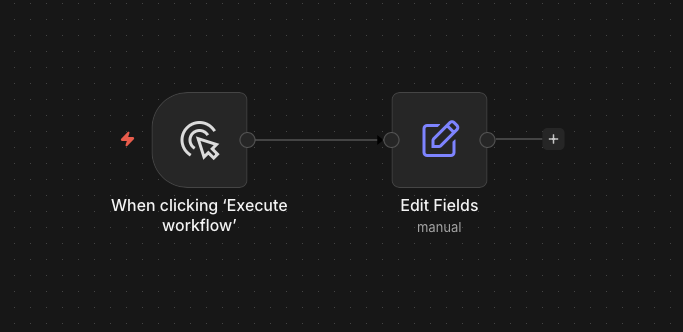
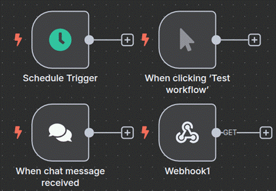
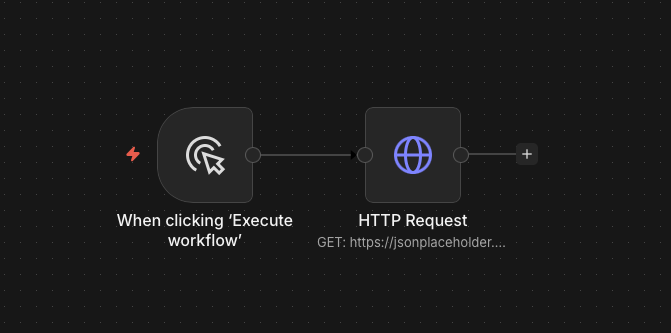

<!-- _class: lead -->

<style scoped>
.logo-bar { position: absolute; top: 36px; right: 64px; display: flex; align-items: center; gap: 16px; }
.logo-bar img { width: 100px; height: 100px; object-fit: contain; }
</style>

<div class="logo-bar">
  
  
</div>

# Workshop: สร้าง Workflow พื้นฐานด้วย n8n

<div class="subtitle">Module 3 — เชื่อมต่อข้อมูลและสร้าง Workflow แรก</div>

**หลักสูตร** การสร้างผู้ช่วยอัจฉริยะ (AI Agent) สำหรับงานสถิติภาครัฐด้วย n8n

ผศ. ดร.ทวีศักดิ์ สมานชื่น
CBTU · คณะวิศวกรรมศาสตร์ · มหาวิทยาลัยมหิดล

---

## วัตถุประสงค์การเรียนรู้

เมื่อจบ module นี้ ผู้เรียนสามารถ:

1. **สร้าง** Workflow ใหม่ตั้งแต่ต้นได้
2. **ใช้** Trigger Node ประเภทต่างๆ ได้ถูกต้อง
3. **เชื่อมต่อ** ข้อมูลจาก HTTP API ภายนอกได้
4. **แปลง** และ **กรอง** ข้อมูลด้วย Set, IF, Code Nodes
5. **ส่งออก** ผลลัพธ์ผ่าน Email หรือไฟล์ได้

---

## เนื้อหาใน Module นี้

1. **Setup & Hello World** — สร้าง Workflow แรก
2. **Trigger Nodes** — Schedule และ Manual Trigger
3. **HTTP Request** — เรียกข้อมูลจาก API
4. **Data Transformation** — Set, IF, Code Nodes
5. **Output** — ส่ง Email และบันทึกไฟล์
6. **Workshop Exercise** — ฝึกปฏิบัติ

---

<!-- _class: divider -->

## 01
## Hello World Workflow

สร้าง Workflow แรกของคุณ


---
## Demo 1: Workflow แรก

<div class="center">



</div>

---

## Demo 1: Workflow แรก

### เป้าหมาย: แสดงข้อความ "Hello Statistics!"

**ขั้นตอน:**

1. คลิก **"New Workflow"** บน Dashboard
2. คลิก `+` บน Canvas เพื่อเพิ่ม Node
3. ค้นหา **"Manual Trigger"** → เพิ่ม
4. คลิก `+` ต่อจาก Manual Trigger
5. เพิ่ม **"Set"** Node
6. เพิ่ม Field: `message` = `Hello Statistics!`
7. กด **"Execute Workflow"** เพื่อรัน

---

## ผลลัพธ์ที่ควรเห็น: Output จาก Set Node

```json
[
  {
      "message": "Hello Statistics!"
  }
]
```

### สิ่งที่เรียนรู้

- วิธีสร้าง Workflow ใหม่
- การเพิ่มและเชื่อม Nodes
- การดู Output ของ Nodes

---

<!-- _class: divider -->

## 02
## Trigger Nodes

เริ่มต้น Workflow ด้วย Triggers


---
## Trigger Nodes

<div class="center">



</div>

---

## Schedule Trigger :  รัน Workflow ตามเวลาที่กำหนด

**การตั้งค่า:**
- **Mode:** Every X minutes / hours / days
- **Cron Expression:** สำหรับตั้งเวลาซับซ้อน

| Cron | ความหมาย |
|---|---|
| `0 8 * * 1-5` | ทุกวันทำงาน เวลา 08:00 |
| `0 9 1 * *` | วันที่ 1 ทุกเดือน เวลา 09:00 |
| `0 */4 * * *` | ทุก 4 ชั่วโมง |
| `0 7 * * 1` | ทุกวันจันทร์ เวลา 07:00 |

---

## Webhook Trigger

### รับข้อมูลจากระบบภายนอก

**ใช้เมื่อ:** ต้องการรับ Event จากระบบอื่น เช่น:
- ระบบสำรวจส่งข้อมูลเข้ามา
- แบบฟอร์มออนไลน์ Submit
- ระบบอื่น Push ข้อมูลให้

**Webhook URL ตัวอย่าง:**
```
https://your-n8n.domain.go.th/webhook/stats-data
```

**การทดสอบ:** ใช้ **Test URL** ใน n8n Editor ก่อน Activate

---

<!-- _class: divider -->

## 03
## HTTP Request Node

เรียกข้อมูลจาก REST API


---
## HTTP Request พื้นฐาน

### Demo 2: ดึงข้อมูลจาก Open Data API

<div class="center">



</div>

---

## HTTP Request พื้นฐาน

### Demo 2: ดึงข้อมูลจาก Open Data API

**เป้าหมาย:** เรียกข้อมูลจาก JSONPlaceholder (API ตัวอย่าง)

**การตั้งค่า HTTP Request Node:**
```
Method:  GET
URL:     https://jsonplaceholder.typicode.com/posts
Headers: (ว่าง)
```

**ผลลัพธ์:** รายการโพสต์ 100 รายการในรูปแบบ JSON

---

## HTTP Request กับ Query Parameters

```
Method: GET
URL:    https://api.example.go.th/statistics
```

**Query Parameters (เพิ่มใน n8n):**

| Name | Value |
|---|---|
| `year` | `{{ $now.year }}` |
| `province` | `all` |
| `format` | `json` |

**URL ที่ได้:** https://api.example.go.th/statistics?year=2567&province=all&format=json

---

## HTTP Request กับ Authentication

### การส่ง API Key

**ผ่าน Header:**
```
Header Name:  Authorization
Header Value: Bearer {{ $credentials.apiKey }}
```

**ผ่าน Query Parameter:**
```
Parameter Name:  api_key
Parameter Value: (เลือกจาก Credentials)
```

> **Best Practice:** สร้าง Credential ใน n8n เสมอ อย่า Hardcode API Key ใน Node

---

<!-- _class: divider -->

## 04
## Data Transformation

แปลงและกรองข้อมูลใน n8n

---

## Set Node — กำหนดค่าตัวแปร

### การใช้ Set Node

**Demo 3: สร้างข้อมูลสรุปอย่างง่าย**

```
Field: report_title    → "รายงานสถิติประจำเดือน"
Field: report_date     → {{ $today }}
Field: data_source     → {{ $json.source }}
Field: total_records   → {{ $json.count }}
```

### โหมดของ Set Node

- **Keep All Fields** — เก็บข้อมูลเดิม + เพิ่มใหม่
- **Replace** — แทนที่ด้วยข้อมูลใหม่เท่านั้น

---

## IF Node — เงื่อนไขการทำงาน

### แยก Flow ตามเงื่อนไข

**Demo 4: ตรวจสอบค่าผิดปกติ**

```
Condition: {{ $json.value }} > 1000000
```

**True Branch** → ส่งแจ้งเตือนว่าข้อมูลสูงผิดปกติ
**False Branch** → ดำเนินการปกติต่อไป

### เงื่อนไขที่รองรับ

- Equal / Not Equal
- Larger / Smaller than
- Contains / Starts With
- Is Empty / Is Not Empty

---

## Code Node — เขียน Custom Logic

### JavaScript ใน n8n

**Demo 5: คำนวณ % การเปลี่ยนแปลง**

```javascript
const items = $input.all();

return items.map(item => {
  const current = item.json.current_value;
  const previous = item.json.previous_value;
  const change = ((current - previous) / previous * 100).toFixed(2);
  
  return {
    json: {
      ...item.json,
      percent_change: parseFloat(change),
      trend: change > 0 ? "เพิ่มขึ้น" : "ลดลง"
    }
  };
});
```

---

## Filter / Split in Batches

### จัดการข้อมูลจำนวนมาก

**Filter Node** — กรองข้อมูลตามเงื่อนไข
```
เก็บเฉพาะ: {{ $json.province }} == "กรุงเทพมหานคร"
```

**Split in Batches** — แบ่งประมวลผลทีละ N รายการ
- ป้องกัน API Rate Limit
- ประมวลผลข้อมูลขนาดใหญ่ได้

**Merge Node** — รวมข้อมูลจากหลาย Branch
- Merge by Position
- Merge by Key (JOIN ข้อมูล 2 ชุด)

---

<!-- _class: divider -->

## 05
## Output: Email & File

ส่งออกผลลัพธ์

---

## ส่งรายงานทาง Email

### Send Email Node (SMTP)

**การตั้งค่า Credential:**
- Protocol: SMTP / Gmail / Outlook
- Host, Port, Username, Password

**การตั้งค่า Email Node:**
```
To:      director@nso.go.th
Subject: รายงานสถิติ {{ $today }} อัตโนมัติ
Body:    ยอดรวมประจำวันนี้: {{ $json.total }}
         ดูรายละเอียดที่ระบบ Dashboard
```

**Attachment:** แนบไฟล์ CSV/Excel ได้

---

## บันทึกไฟล์ Excel/CSV

### Write Binary File + Spreadsheet

**Demo 6: Export ข้อมูลเป็น Excel**

1. **Spreadsheet File Node** (Write mode)
   - File Format: XLSX หรือ CSV
   - ใส่ข้อมูลจาก Input
2. **Write Binary File Node**
   - File Path: `/data/reports/report-{{ $today }}.xlsx`

> **หมายเหตุ:** ต้อง Mount Volume ใน Docker ให้ถูกต้อง

---

<!-- _class: divider -->

## 06
## Workshop Exercise

ฝึกปฏิบัติ

---

<!-- _class: highlight -->

## แบบฝึกหัด 3.1 — รายงานอากาศอัตโนมัติ

### โจทย์

สร้าง Workflow ที่:
1. **ทำงานทุกเช้า** เวลา 07:00 น.
2. **ดึงข้อมูลอากาศ** จาก Open-Meteo API (Free, ไม่ต้องใช้ API Key)
3. **แปลงข้อมูล** — คำนวณค่าเฉลี่ยอุณหภูมิ
4. **ส่ง Email** สรุปสภาพอากาศประจำวัน

### API ที่ใช้

```
URL: https://api.open-meteo.com/v1/forecast
Parameters: latitude=13.75, longitude=100.52
            daily=temperature_2m_max,temperature_2m_min
            timezone=Asia/Bangkok
```

---

<!-- _class: highlight -->

## แบบฝึกหัด 3.2 — Data Cleaning Pipeline

### โจทย์

สร้าง Workflow ที่:
1. **รับข้อมูล** จาก Webhook (จำลองการส่งข้อมูลสำรวจ)
2. **ตรวจสอบ** ว่าข้อมูลครบถ้วน (ไม่มีค่า null)
3. **กรอง** เฉพาะข้อมูลที่ผ่านการตรวจสอบ
4. **บันทึก** ลงไฟล์ CSV แยก: `valid.csv` และ `invalid.csv`

### สิ่งที่ต้องทำ

1. สร้าง Webhook Trigger
2. ใช้ IF Node ตรวจสอบ required fields
3. ใช้ Merge Node รวมผลลัพธ์
4. Export ด้วย Spreadsheet File Node

> **Dataset:** ทดสอบด้วย Postman หรือ curl

---

## เฉลย: โครงสร้าง Workflow 3.1

```
[Schedule Trigger]
       │ ทุกวัน 07:00
       ▼
[HTTP Request]
       │ GET Open-Meteo API
       ▼
[Code Node]
       │ คำนวณค่าเฉลี่ยอุณหภูมิ
       ▼
[Set Node]
       │ จัดรูปแบบข้อความ Email
       ▼
[Send Email]
         ส่งรายงานอากาศ
```

---

<!-- _class: divider -->

## 07
## สรุปและบทเรียนถัดไป

Summary & What's Next

---

## สรุป Module 3

### สิ่งที่เรียนรู้ใน Module นี้

- ✅ **สร้าง Workflow** ตั้งแต่ต้นด้วย Manual & Schedule Trigger
- ✅ **HTTP Request** เรียก REST API พร้อม Authentication
- ✅ **Data Transformation** — Set, IF, Code, Filter Nodes
- ✅ **Output** — ส่ง Email และ Export ไฟล์ Excel/CSV
- ✅ **Workshop** — ฝึกสร้าง Workflow จริงด้วยข้อมูลจริง

### Module ถัดไป

**Module 4:** Workshop — สร้าง Workflow ดึงและประมวลผลข้อมูลสถิติอัตโนมัติ

---

<!-- _class: lead -->

# เยี่ยมมาก! Workflow แรกสำเร็จแล้ว

**Module 4:** ต่อยอดด้วย Workflow ข้อมูลสถิติภาครัฐ
