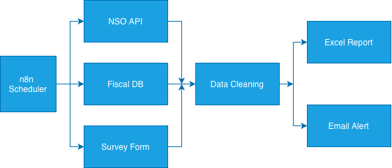
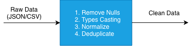
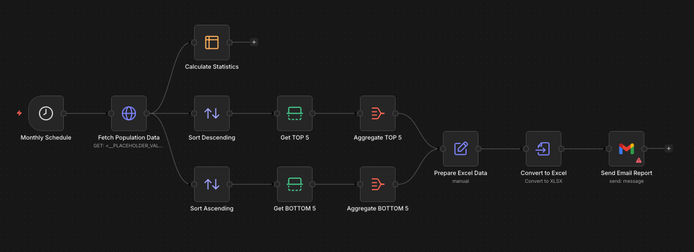
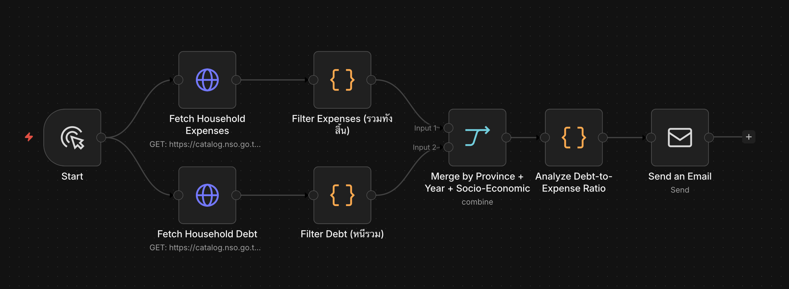

<!-- _class: lead -->

<style scoped>
.logo-bar { position: absolute; top: 36px; right: 64px; display: flex; align-items: center; gap: 16px; }
.logo-bar img { width: 100px; height: 100px; object-fit: contain; }
</style>

<div class="logo-bar">
  
  
</div>

# Workshop: ดึงและประมวลผลข้อมูลสถิติอัตโนมัติ

<div class="subtitle">Module 4 — End-to-End Statistics Data Pipeline</div>

**หลักสูตร** การสร้างผู้ช่วยอัจฉริยะ (AI Agent) สำหรับงานสถิติภาครัฐด้วย n8n

ผศ. ดร.ทวีศักดิ์ สมานชื่น
CBTU · คณะวิศวกรรมศาสตร์ · มหาวิทยาลัยมหิดล

---

## วัตถุประสงค์การเรียนรู้

เมื่อจบ module นี้ ผู้เรียนสามารถ:

1. **ออกแบบ** Pipeline ดึงข้อมูลสถิติจากแหล่งข้อมูลภาครัฐ
2. **ประมวลผล** และ **สรุป** ข้อมูลสถิติอัตโนมัติ
3. **ตั้งเวลา** ให้ระบบทำงานอัตโนมัติแบบ Scheduled
4. **สร้าง** รายงานสรุปและส่งให้ผู้บริหารอัตโนมัติ
5. **จัดการ** Error Handling และ Monitoring

---

## เนื้อหาใน Module นี้

1. **ภาพรวม Pipeline** — Architecture ของระบบ
2. **แหล่งข้อมูลสถิติภาครัฐ** — Open Data APIs ไทย
3. **Data Extraction** — ดึงข้อมูลจาก Multiple Sources
4. **Data Processing** — ประมวลผลและสรุปข้อมูล
5. **Reporting & Alerting** — รายงานและแจ้งเตือน
6. **Workshop** — สร้าง Full Pipeline

---

<!-- _class: divider -->

## 01
## Architecture ภาพรวม

Statistics Data Pipeline Design

---

## Pipeline Architecture

### End-to-End Data Pipeline


<div class="center">



</div>

---

## แหล่งข้อมูลที่จะใช้ใน Workshop

### Open Data APIs สำหรับงานสถิติไทย

| แหล่งข้อมูล | URL | ประเภทข้อมูล |
|---|---|---|
| **data.go.th** | api.data.go.th | Open Government Data |
| **Data Catalog** | catalog.nso.go.th | สถิติเศรษฐกิจ |
| **BOT** | api.bot.or.th | ข้อมูลการเงิน |
| **DDC** | covid19.ddc.moph.go.th | สุขภาพ |
| **Open-Meteo** | api.open-meteo.com | สภาพอากาศ (Free) |

---

<!-- _class: divider -->

## 02
## แหล่งข้อมูลสถิติภาครัฐ

ระบบบัญชีข้อมูลสำนักงานสถิติแห่งชาติ NSO Data Catalog

---

## [catalog.nso.go.th](https://catalog.nso.go.th)

<div class="columns">
<div>

### การเข้าถึงข้อมูลภาครัฐ

**ขั้นตอนการใช้งาน:**
1. ค้นหา Dataset ที่ต้องการ
2. ดู API Documentation ของ Dataset นั้น

</div>
<div>

**ตัวอย่าง API Call:**
```
GET https://catalog.nso.go.th/api/3/action/datastore_search
    ?resource_id=a2443986-6b68-4f44-a94b-b84b0fc50c96
    &limit=100
```

</div>
</div>

---

## ตัวอย่าง: รายได้เฉลี่ยต่อเดือนของครัวเรือน (NSO)

**CKAN API (NSO Catalog):**
```
GET https://catalog.nso.go.th/api/3/action/datastore_search
    ?resource_id=a2443986-6b68-4f44-a94b-b84b0fc50c96
    &limit=100
```

**Columns ที่ได้:** `YEAR`, `REGION`, `AREA`, `MONTHLY_INCOME`, `FROM_WORK`, `PROPERTY_INCOME`, `CURRENT_TRANSFER`, `NONMONEY_INCOME`

**ผลลัพธ์:** รายได้เฉลี่ยต่อเดือนของครัวเรือน จำแนกตามภาคและพื้นที่ (พ.ศ. 2500–2562)


---

<!-- _class: divider -->

## 03
## Data Processing

ประมวลผลและทำความสะอาดข้อมูล

---

## Data Cleaning Pipeline

### ขั้นตอนการทำความสะอาดข้อมูล


<div class="center">



</div>

---
<!-- _class: dense -->
## Code Node: Data Cleaning

<div class="columns">
<div>

### ขั้นตอน

1. **กรอง** ข้อมูลที่ไม่ครบ
2. **แปลงชนิด** String → Number/Date
3. **ตรวจค่า** ที่ไม่สมเหตุสมผล

> Input: JSON จาก HTTP Request
> Output: Array ของ Items ที่สะอาด

</div>
<div>

```javascript
const items = $input.all();
return items
  .filter(item =>
    item.json.province &&
    item.json.value !== null)
  .map(item => ({
    json: {
      province: item.json.province.trim(),
      value: parseFloat(item.json.value) || 0,
      year: parseInt(item.json.year),
      updated_at: new Date().toISOString()
    }
  }))
  .filter(item =>
    item.json.value >= 0 &&
    item.json.year >= 2500);
```

</div>
</div>

---
<!-- _class: dense -->
## Code Node:  Data Aggregation

<div class="columns">
<div>

### สิ่งที่คำนวณได้

| ค่า | วิธีคำนวณ |
|---|---|
| `total` | รวมทุก record |
| `avg` | total ÷ จำนวน |
| `max` / `min` | ค่าสูง/ต่ำสุด |
| `by_region` | groupBy ภาค |

</div>
<div>

```javascript
const data = $input.all()
  .map(i => i.json);
const values = data.map(d => d.value);
const total = values.reduce((a,b) => a+b, 0);
const avg   = total / values.length;
const max   = Math.max(...values);
const min   = Math.min(...values);
const byRegion = data.reduce((acc, item) => {
  acc[item.region] =
    (acc[item.region] || 0) + item.value;
  return acc;
}, {});
return [{ json: { total, avg, max, min,
                  by_region: byRegion } }];
```

</div>
</div>

---

## Join ข้อมูลจากหลายแหล่ง

### Merge Node — รวมข้อมูล 2 ชุด

**กรณีการใช้งาน:** รวมข้อมูลประชากร + ข้อมูล GDP ต่อจังหวัด

```
[Population API] ──┐
                   ├──► [Merge Node] ──► [Code: คำนวณ GDP/capita]
[GDP API]        ──┘     (Join by "province_code")
```

**การตั้งค่า Merge Node:**
- **Mode:** Combine
- **Combine By:** Matching Rules
- **Fields to Match:** `province_code` = `province_code`

---

<!-- _class: divider -->

## 04
## Reporting & Alerting

สร้างรายงานและระบบแจ้งเตือน

---

## สร้างรายงาน Excel อัตโนมัติ

### Workflow: Monthly Report Generation


<div class="center">


</div>


---

<!-- _class: dense -->

## Template รายงาน HTML Email

<div class="columns">
<div>

**โครงสร้าง Email:**
- `<h2>` — หัวข้อรายงาน
- `<table>` — ตารางข้อมูล
- Header row สี `#1B4F72`
- ใส่ n8n expressions `{{ }}` ในแต่ละ cell

> ใช้ใน **Send Email Node**
> ช่อง Body → HTML mode

</div>
<div>

```html
<h2>รายงานสถิติ {{ $json.month }}</h2>
<table border="1"
  style="border-collapse:collapse;width:100%">
  <tr style="background:#1B4F72;color:white">
    <th>ตัวชี้วัด</th>
    <th>ค่า</th>
    <th>เปลี่ยนแปลง</th>
  </tr>
  <tr>
    <td>รายได้เฉลี่ย (บาท/เดือน)</td>
    <td>{{ $json.avg_income }}</td>
    <td>{{ $json.income_change }}%</td>
  </tr>
</table>
```

</div>
</div>

---


## ระบบแจ้งเตือนความผิดปกติ : Psuedo Code

```
สำหรับแต่ละ item:
  คำนวณ pct = |value - previous| / previous × 100
  ถ้า pct > threshold:
    สร้าง alert:
      - indicator = ชื่อตัวชี้วัด
      - message   = "เปลี่ยนแปลง X%"
      - severity  = HIGH  (ถ้า pct > threshold × 2)
                    MEDIUM (อื่นๆ)
    เพิ่มเข้า alerts[]
ถ้า alerts ไม่ว่าง → return alerts
ไม่มี alert        → return { no_alerts: true }
```

---

## Integration กับช่องทางอื่น

<div class="columns">
<div>

**LINE Notify:**
```
POST https://notify-api.line.me/api/notify
Header: Authorization: Bearer {LINE_TOKEN}
Body:   message={{ $json.message }}
```

**Slack:**
- ใช้ Slack Node ใน n8n โดยตรง

</div>
<div>

**Microsoft Teams (Webhook):**
```json
POST https://your-org.webhook.office.com/...
{
  "text": "รายงานสถิติประจำวัน\n{{ $json.summary }}"
}
```

</div>
</div>

---

<!-- _class: divider -->

## 05
## Workshop Exercise

สร้าง Full Statistics Pipeline

---

<!-- _class: highlight -->

## Workshop A — Population Statistics Pipeline

### โจทย์: สร้าง Automated Pipeline **Dataset:** ข้อมูลประชากรจากสำนักงานสถิติแห่งชาติ (NSO)
```
GET https://catalog.nso.go.th/api/3/action/datastore_search
    ?resource_id=57ff7cd9-27e3-4dc5-b6ad-e8280ab18a05&limit=5000
```

1. ดึงข้อมูลประชากรรายจังหวัดจาก NSO Open Data API
2. กรองเฉพาะข้อมูลรวมรายจังหวัด (area=รวม, sex=รวม, age_group=รวม)
3. คำนวณ: ค่าเฉลี่ย, สูงสุด, ต่ำสุด, รวมทั้งประเทศ
4. แยกข้อมูล TOP 5 และ BOTTOM 5 จังหวัดตามจำนวนประชากร
5. Export เป็น Excel Report และส่ง Email สรุปอัตโนมัติ

---

## โครงสร้างข้อมูล NSO Dataset


| ฟิลด์ | ชนิด | ตัวอย่างค่า | ความหมาย |
|---|---|---|---|
| `year` | numeric | `2533`, `2543`, `2553` | ปีพุทธศักราช |
| `region` | text | `ทั่วประเทศ`, `กลาง` | ภาค |
| `province` | text | `รวม`, `กรุงเทพมหานคร` | จังหวัด |
| `area` | text | `รวม`, `ในเขตเทศบาล` | ประเภทพื้นที่ |
| `sex` | text | `รวม`, `ชาย`, `หญิง` | เพศ |
| `age_group` | text | `รวม`, `0-4` | กลุ่มอายุ |
| `value` | numeric | `54548530` | จำนวนประชากร (คน) |

> **Total records: 38,720** | **ปีข้อมูล:** พ.ศ. 2533–ปัจจุบัน

---
<!-- _class: dense -->
## Hint: ขั้นตอนที่ 1 — HTTP Request Node

### ตั้งค่า HTTP Request (ระบุปีที่ต้องการ)

**วิธีที่ 1 — Query String (เร็ว, Filter ฝั่ง Server):**
```
Method:  GET
URL:     https://catalog.nso.go.th/api/3/action/datastore_search
         ?resource_id=57ff7cd9-27e3-4dc5-b6ad-e8280ab18a05
         &limit=5000&filters={"year":2563}
```


---
<!-- _class: dense -->
## Hint: Workshop A

### Workflow Structure

<div class="center">



</div>


---

<!-- _class: highlight -->

## Workshop B — Household Finance Analysis Pipeline

### โจทย์: วิเคราะห์ฐานะทางการเงินครัวเรือนไทยจาก NSO Open Data


| | Dataset | resource_id |
|---|---|---|
| **ชุดที่ 1** | ค่าใช้จ่ายเฉลี่ยต่อเดือนของครัวเรือน จำแนกตามประเภทค่าใช้จ่าย | `697c9b29-d937-4c4e-9d9f-122ff085488b` |
| **ชุดที่ 2** | หนี้สินเฉลี่ยต่อครัวเรือน จำแนกตามวัตถุประสงค์การกู้ยืม | `89cc71ae-f596-4307-b38f-10d61d084801` |

**ความต้องการ:**
1. ดึงข้อมูลจาก 2 API พร้อมกัน (Parallel)
2. คำนวณ **สัดส่วนหนี้สิน/ค่าใช้จ่าย** จำแนกตามสถานะทางเศรษฐสังคม
3. หาจังหวัดที่มีภาระหนี้สูงสุด / ต่ำสุด
4. สร้าง Summary Report ส่ง Email อัตโนมัติ

---

## โครงสร้างข้อมูล: ชุดที่ 1 — ค่าใช้จ่ายครัวเรือน

**Resource ID:** `697c9b29-d937-4c4e-9d9f-122ff085488b` | **Total: 10,780 records** | **ปีข้อมูล:** 2566

| ฟิลด์ | ชนิด | ตัวอย่างค่า |
|---|---|---|
| `year` | text | `"2566"` |
| `province` | text | `"กรุงเทพมหานคร"`, `"เชียงใหม่"` |
| `soc_eco_class1` | text | `"ลูกจ้าง"`, `"ผู้ประกอบธุรกิจ..."`, `"ผู้ถือครองทำการเกษตร..."` |
| `soc_eco_class2` | text | รายละเอียดสถานะ เช่น `"ผู้จัดการนักวิชาการ..."` |
| `type_expenditure1` | text | `"ค่าใช้จ่ายเพื่อการอุปโภคบริโภค"` / `"ค่าใช้จ่ายทั้งสิ้นต่อเดือน"` |
| `type_expenditure2` | text | `"อาหารและเครื่องดื่ม"`, `"ที่อยู่อาศัย..."`, `"การศึกษา"` |
| `value` | numeric | `21740.00` (บาท/เดือน) |

```
GET https://catalog.nso.go.th/api/3/action/datastore_search
    ?resource_id=697c9b29-d937-4c4e-9d9f-122ff085488b&limit=5000
```

---

## โครงสร้างข้อมูล: ชุดที่ 2 — หนี้สินครัวเรือน

**Resource ID:** `89cc71ae-f596-4307-b38f-10d61d084801` | **Total: 7,700 records** | **ปีข้อมูล:** 2566

| ฟิลด์ | ชนิด | ตัวอย่างค่า |
|---|---|---|
| `year` | text | `"2566"` |
| `province` | text | `"กรุงเทพมหานคร"`, `"สมุทรปราการ"` |
| `soc_eco_class1` | text | `"ลูกจ้าง"`, `"ผู้ประกอบธุรกิจ..."`, `"ผู้ถือครองทำการเกษตร..."` |
| `soc_eco_class2` | text | รายละเอียดสถานะ เช่น `"คนงานด้านการขนส่ง..."` |
| `hhdebt_totaldebt` | text | `"จำนวนครัวเรือนทั้งสิ้น"` / `"จำนวนหนี้สินเฉลี่ยต่อครัวเรือน"` |
| `purpose_source_bor` | text | `"จำนวนหนี้สินเฉลี่ยต่อครัวเรือน"` / `"ใช้ซื้อ/เช่าซื้อบ้าน..."` / `"หนี้ในระบบ"` |
| `value` | numeric | `300000.00` (บาท) หรือ จำนวนครัวเรือน |
| `unit` | text | `"บาท"` หรือ `"ครัวเรือน"` |

```
GET https://catalog.nso.go.th/api/3/action/datastore_search
    ?resource_id=89cc71ae-f596-4307-b38f-10d61d084801&limit=5000
```

---
<!-- _class: dense -->
## Hint: ขั้นตอนที่ 1 — ดึงข้อมูล 2 แหล่งพร้อมกัน

### Workflow Structure (Parallel HTTP Requests)


<div class="center">



</div>

---

<!-- _class: divider -->

## 06
## Best Practices & Production Tips

แนวทางปฏิบัติที่ดีสำหรับ Production

---

## Best Practices

### การพัฒนา Workflow คุณภาพสูง

<div class="columns">
<div>

**1. ตั้งชื่อ Node ให้ชัดเจน**
- ❌ `HTTP Request 1`, `Set 3`
- ✅ `GET Population Data`, `Calculate Summary Stats`

**2. ใช้ Notes (Sticky Notes)**
- อธิบาย Logic ซับซ้อน
- บันทึก API Documentation Reference

</div>
<div>

**3. แยก Workflow ตามหน้าที่**
- Workflow หลัก (Main Pipeline)
- Workflow Error Handler แยกต่างหาก
- Workflow Utility Functions

</div>
</div>

---

## Security Best Practices

### ความปลอดภัยสำหรับภาครัฐ

- 🔑 **ใช้ Credentials เสมอ** — ห้าม Hardcode API Key
- 🔒 **HTTPS เท่านั้น** สำหรับ API ภายนอก
- 🏛️ **Self-hosted** — ข้อมูลสำคัญต้องอยู่ใน Server องค์กร
- 👤 **Role-Based Access** — ตั้ง Permission ผู้ใช้ n8n
- 📋 **Audit Log** — เปิด Execution History ทุก Workflow
- 🔄 **Backup** — Backup n8n Database สม่ำเสมอ

---

## สรุป Module 4

### สิ่งที่เรียนรู้ใน Module นี้

- ✅ **Pipeline Architecture** ออกแบบระบบ End-to-End
- ✅ **Government Open Data** APIs สำหรับงานสถิติไทย
- ✅ **Data Cleaning & Aggregation** ด้วย Code Node
- ✅ **Merge ข้อมูล** จากหลายแหล่งด้วย Merge Node
- ✅ **Excel Report + Email** ส่งรายงานอัตโนมัติ
- ✅ **Security Best Practices** สำหรับภาครัฐ


