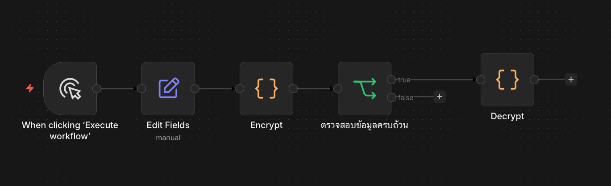

<!-- _class: lead -->

<style scoped>
.logo-bar { position: absolute; top: 36px; right: 64px; display: flex; align-items: center; gap: 16px; }
.logo-bar img { width: 100px; height: 100px; object-fit: contain; }
</style>

<div class="logo-bar">
  
  
</div>

# Encryption Sensitive Data

<div class="subtitle">Module 6 — การเข้ารหัสและปกป้องข้อมูลสำคัญใน Workflow</div>

**หลักสูตร** การสร้างผู้ช่วยอัจฉริยะ (AI Agent) สำหรับงานสถิติภาครัฐด้วย n8n

ผศ. ดร.ทวีศักดิ์ สมานชื่น
CBTU · คณะวิศวกรรมศาสตร์ · มหาวิทยาลัยมหิดล

---

## วัตถุประสงค์การเรียนรู้

เมื่อจบ module นี้ ผู้เรียนสามารถ:

1. **อธิบาย** ความสำคัญของการปกป้องข้อมูลในบริบทภาครัฐ
2. **จำแนก** ประเภทข้อมูลที่ต้องเข้ารหัสตามกฎหมาย PDPA
3. **ใช้งาน** Crypto Node และ Code Node ใน n8n สำหรับการเข้ารหัส
4. **ออกแบบ** Workflow ที่ปลอดภัยด้วย Credential Management
5. **ประยุกต์** Best Practice ด้านความปลอดภัยใน Workflow สถิติภาครัฐ

---

## เนื้อหาใน Module นี้

1. **ทำไมต้องเข้ารหัส?** — PDPA และข้อมูลภาครัฐ
2. **ประเภทของข้อมูลสำคัญ** — Sensitive Data Classification
3. **Encryption Methods** — Symmetric, Hashing, และ Tokenization
4. **Workshop:** เข้ารหัสข้อมูลใน n8n Workflow
5. **Credential Management** — จัดการ API Key และ Password อย่างปลอดภัย

---

<!-- _class: divider -->

## 01
## ทำไมต้องเข้ารหัส?

Data Protection in Government Statistics

---

## ข้อมูลภาครัฐกับความเสี่ยง

### สถานการณ์ที่เกิดขึ้นได้

- 📋 **ข้อมูลส่วนบุคคล** รั่วไหลระหว่างส่ง Workflow
- 🔑 **API Key / Password** ถูก Expose ใน Log
- 📊 **ข้อมูลสถิติลับ** ถูกส่งผ่าน Webhook ที่ไม่ปลอดภัย
- 🗃️ **ไฟล์สำรอง (Backup)** ไม่ได้เข้ารหัส ใครก็เปิดได้

### กฎหมายที่เกี่ยวข้อง

| กฎหมาย | สาระสำคัญ |
|---|---|
| **PDPA (พ.ร.บ. คุ้มครองข้อมูลส่วนบุคคล)** | ต้องปกป้องข้อมูลส่วนบุคคลจากการเข้าถึงโดยไม่ได้รับอนุญาต |
| **พ.ร.บ. ความมั่นคงปลอดภัยไซเบอร์** | หน่วยงานภาครัฐต้องมีมาตรการรักษาความมั่นคงปลอดภัย |

---

## ข้อมูลที่ต้องปกป้อง (PDPA)

### Sensitive Data Categories

| ประเภท | ตัวอย่าง | ระดับความเสี่ยง |
|---|---|---|
| **ข้อมูลส่วนบุคคลทั่วไป** | ชื่อ, อีเมล, เบอร์โทร | Medium |
| **ข้อมูลส่วนบุคคลอ่อนไหว** | เลขบัตรประชาชน, สุขภาพ | High |
| **ข้อมูลทางการเงิน** | เลขบัญชี, รายได้ | High |
| **ข้อมูลลับทางราชการ** | ข้อมูลสถิติที่ยังไม่เผยแพร่ | Critical |
| **Credentials** | API Key, Password, Token | Critical |

---

<!-- _class: divider -->

## 02
## Encryption Methods

วิธีการเข้ารหัสที่ควรรู้

---

## 3 วิธีหลักในการปกป้องข้อมูล

<div class="columns">
<div>

### 🔒 Symmetric Encryption (AES)
- ใช้ Key เดียวทั้งเข้าและถอดรหัส
- **ถอดรหัสได้** — ต้องมี Secret Key
- เหมาะกับ: เลขบัตรประชาชน, ข้อมูลที่ต้องนำกลับมาใช้
- ใน n8n: Code Node + `crypto` module

### #️⃣ Hashing (SHA-256 / bcrypt)
- เปลี่ยนข้อมูลเป็น Hash **ย้อนกลับไม่ได้**
- เหมาะกับ: Password, Checksum
- ตรวจสอบความถูกต้องโดยไม่ต้องเห็นข้อมูลเดิม

</div>
<div>

### 🎫 Tokenization
- แทนข้อมูลจริงด้วย Token สุ่ม
- เหมาะกับ: บัตรเครดิต, เลขบัตรประชาชน แบบ Reference
- ข้อมูลจริงเก็บในระบบแยก (Token Vault)


</div>
</div>

---

## เปรียบเทียบ


| วิธี | ถอดรหัส? | ใช้เมื่อ |
|---|---|---|
| AES | ✅ | ต้องการข้อมูลเดิม |
| SHA-256 | ❌ | ตรวจสอบเท่านั้น |
| Token | ✅ (via vault) | Reference ปลอดภัย |

---

<!-- _class: divider -->

## 03
## Workshop: Encryption ใน n8n

ปกป้องข้อมูลใน Workflow อัตโนมัติ

---

## Workshop: เข้ารหัสข้อมูลด้วย Code Node

### โครงสร้าง Workflow

<div class="center">



</div>

### ข้อมูลที่รับเข้ามา (Input)
```json
{ "name": "สมชาย ใจดี", "id_card": "1234567890123", "email": "somchai@nso.go.th" }
```
---
<!-- _class: dense -->
## Code Node: AES Encryption

```javascript
const crypto = require('crypto');
const SECRET_KEY = $vars.ENCRYPTION_KEY; // 32-byte key จาก n8n Environment
const IV = crypto.randomBytes(16);
function encrypt(text) {
  const cipher = crypto.createCipheriv('aes-256-cbc', Buffer.from(SECRET_KEY), IV);
  let encrypted = cipher.update(text, 'utf8', 'hex');
  encrypted += cipher.final('hex');
  return IV.toString('hex') + ':' + encrypted;
}
return {
  json: {
    name: $json.name,           // เก็บชื่อตามปกติ
    id_card_encrypted: encrypt($json.id_card),  // เข้ารหัสเลขบัตร
    email_hash: crypto.createHash('sha256').update($json.email).digest('hex'),
  }
};
``` 
<!-- 
---
## Code Node: ถอดรหัส (Decrypt)
```javascript
const crypto = require('crypto');
const SECRET_KEY = $env.ENCRYPTION_KEY;
function decrypt(encryptedText) {
  const [ivHex, encrypted] = encryptedText.split(':');
  const iv = Buffer.from(ivHex, 'hex');
  const decipher = crypto.createDecipheriv('aes-256-cbc', Buffer.from(SECRET_KEY), iv);
  let decrypted = decipher.update(encrypted, 'hex', 'utf8');
  decrypted += decipher.final('utf8');
  return decrypted;
}
return [{
  json: {
    id_card_original: decrypt($input.item.json.id_card_encrypted)
  }
}];
```

> **สำคัญ:** Secret Key ต้องเก็บใน n8n Environment Variables เท่านั้น ห้ามใส่ใน Code โดยตรง 

-->


---

<!-- _class: divider -->

## 04
## Credential Management

จัดการ Key และ Secret อย่างปลอดภัยใน n8n

---

## n8n Credential System

### วิธีจัดการ Credential ที่ถูกต้อง

- 🔐 **n8n Credentials** — เก็บ API Key, Password ใน Vault ของ n8n (เข้ารหัสอัตโนมัติ)
- 🌍 **Environment Variables** — เก็บ Secret ที่ไม่ควรอยู่ใน Workflow เช่น `ENCRYPTION_KEY`
- 🚫 **อย่าเก็บใน Node** — ไม่ควร Hardcode key ใน Set Node หรือ Code โดยตรง

### การตั้งค่า Environment Variables ใน n8n

```bash
# ตั้งค่าในตัวแปรใน Variables
ENCRYPTION_KEY=your-32-byte-secret-key-here
```

---

## Secure Workflow Checklist

### ตรวจสอบก่อน Deploy Workflow

- [ ] API Key ทุกตัวเก็บใน n8n Credentials — ไม่ใช่ใน Node Text
- [ ] ข้อมูลส่วนบุคคล (PII) ถูกเข้ารหัสก่อนบันทึก
- [ ] ไม่มี Sensitive Data ปรากฏใน Execution Log
- [ ] Webhook มีการตรวจสอบ Authorization Header
- [ ] Environment Variables ใช้สำหรับ Secret Keys

> **Webhook Security:** ใช้ `Header Auth` หรือ `Basic Auth` กับ n8n Webhook เสมอ

---

<!-- _class: divider -->

## 05
## สรุปและบทเรียนถัดไป

Summary & What's Next

---

## สรุป Module 6

### สิ่งที่เรียนรู้ใน Module นี้

- ✅ **ความสำคัญ** ของการปกป้องข้อมูลตาม PDPA และกฎหมายไซเบอร์
- ✅ **ประเภทข้อมูล** ที่ต้องเข้ารหัสในงานสถิติภาครัฐ
- ✅ **AES Encryption** — เข้า/ถอดรหัสด้วย Code Node ใน n8n
- ✅ **SHA-256 Hashing** — ตรวจสอบความถูกต้องและเก็บ Password
- ✅ **Credential Management** — จัดการ Key อย่างปลอดภัยใน n8n

### Module ถัดไป

**Module 7:** Workshop Basic AI Agent on n8n — สร้าง Agent ที่ตัดสินใจและใช้เครื่องมือได้


---

<!-- _class: lead -->

# จบ Day 1 แล้ว!

**พรุ่งนี้ Day 2:** พัฒนา AI Agent สำหรับงานสถิติ

ขอบคุณทุกท่านที่ตั้งใจเรียน — พบกันพรุ่งนี้ 09.00 น.