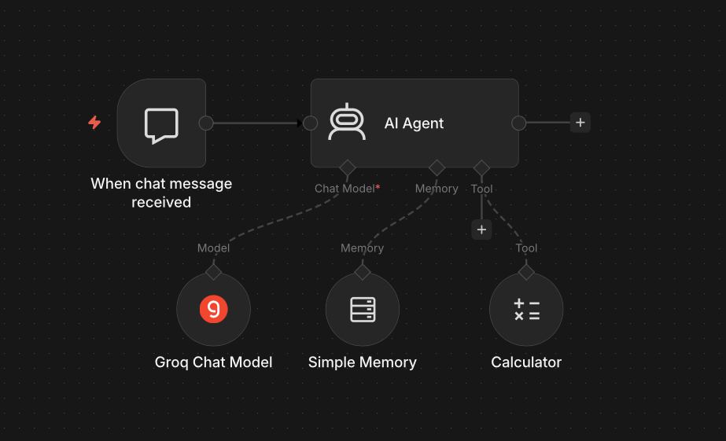
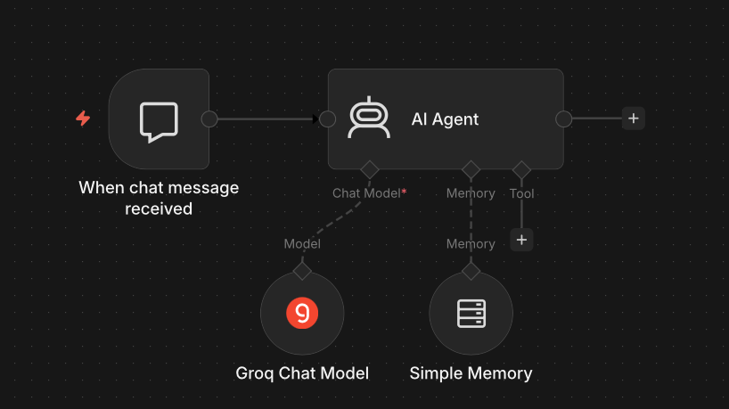
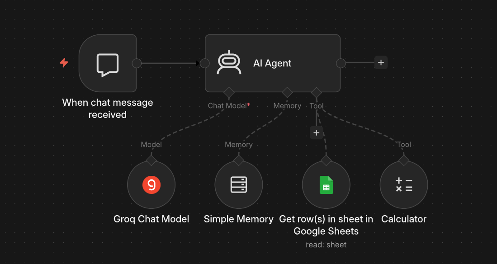
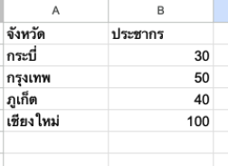

<!-- _class: lead -->

<style scoped>
.logo-bar { position: absolute; top: 36px; right: 64px; display: flex; align-items: center; gap: 16px; }
.logo-bar img { width: 100px; height: 100px; object-fit: contain; }
</style>

<div class="logo-bar">
  
  
</div>

# Workshop: Basic AI Agent on n8n

<div class="subtitle">Module 7 — สร้าง AI Agent และ Agent with Tools บน n8n</div>

**หลักสูตร** การสร้างผู้ช่วยอัจฉริยะ (AI Agent) สำหรับงานสถิติภาครัฐด้วย n8n

ผศ. ดร.ทวีศักดิ์ สมานชื่น
CBTU · คณะวิศวกรรมศาสตร์ · มหาวิทยาลัยมหิดล


---

## ทบทวน Day 1


| Module | หัวข้อ |
|---|---|
| **Module 1** | Introduction AI and Workflow Automation |
| **Module 2** | Introduction to n8n |
| **Module 3** | Workshop: Basic Workflow — Data Table & Google Sheets |
| **Module 4** | Workshop: Statistics Data Pipeline |
| **Module 5** | Workshop: Sentiment Analysis & Satisfaction (100 ชุด) |
| **Module 6** | Encryption Sensitive Data |

### Day 2 Focus

**AI Agent** — Introduction to AI Agent + วิเคราะห์ข้อมูลสถิติจริง + ใช้งานในหน่วยงาน

---

## วัตถุประสงค์การเรียนรู้

เมื่อจบ module นี้ ผู้เรียนสามารถ:

1. **อธิบาย** ความแตกต่างระหว่าง AI Workflow กับ AI Agent
2. **สร้าง** Basic AI Agent บน n8n ด้วย AI Agent Node
3. **เชื่อมต่อ** Memory เพื่อให้ Agent จำบริบทการสนทนา
4. **เพิ่ม Tools** ให้ Agent เรียกใช้ข้อมูลและ Workflow ได้
5. **ทดสอบ** Agent ผ่าน Chat UI และ Webhook

---

## เนื้อหาใน Module นี้

1. **AI Agent คืออะไร?** — Agent vs Workflow
2. **n8n AI Agent Architecture** — Nodes และ Components
3. **Workshop Lab A:** Basic AI Agent พร้อม Memory
4. **Workshop Lab B:** AI Agent with Tools — เชื่อมต่อเครื่องมือจริง
5. **ทดสอบและ Debug** — ตรวจสอบการทำงานของ Agent

---

<!-- _class: divider -->

## 01
## AI Agent คืออะไร?

From Workflow to Autonomous Agent

---

## Workflow vs AI Agent

### ความแตกต่างสำคัญ

| | **Workflow** | **AI Agent** |
|---|---|---|
| **การทำงาน** | ทำตามขั้นตอนตายตัว | ตัดสินใจเองได้ |
| **Input** | ข้อมูลมีโครงสร้าง | คำถาม / คำสั่งภาษาธรรมชาติ |
| **Output** | ผลลัพธ์กำหนดล่วงหน้า | ตอบสนองตามสถานการณ์ |
| **Tools** | ไม่มี | เรียกใช้ Tool เองได้ |
| **Memory** | ไม่มี | จำบริบทได้ |

---
### AI Agent คือ

> Workflow ที่มี LLM เป็น "สมอง" ตัดสินใจเองว่าจะทำขั้นตอนใด ด้วยเครื่องมืออะไร

---

## ReAct Pattern: วิธีคิดของ AI Agent

### Reasoning + Acting Loop

```
[คำถามจากผู้ใช้]-> [Reasoning: LLM คิดว่าต้องทำอะไร] -> [Action: เรียกใช้ Tool ที่เลือก]->
[Observation: ดูผลลัพธ์จาก Tool]->[Reasoning: พอแล้วหรือต้องทำต่อ?]->[Final Answer: ตอบผู้ใช้]
```

### ตัวอย่าง
- "สถิติการจ้างงานเดือนล่าสุดเป็นเท่าไหร่?" → Agent เรียก API → คำนวณ → ตอบ

---

## n8n AI Agent Architecture

### ส่วนประกอบหลักของ AI Agent บน n8n

| Component | n8n Node | หน้าที่ |
|---|---|---|
| **Brain (LLM)** | OpenAI / Anthropic Node | ตัดสินใจและสร้างคำตอบ |
| **Memory** | Window Buffer Memory | จำบริบทการสนทนา |
| **Tools** | Custom n8n Workflows | ดึงข้อมูล / ทำงานจริง |
| **Trigger** | Chat Trigger / Webhook | รับ Input จากผู้ใช้ |

---
## AI Agent n8n Workflow

<div class="center">



</div>

---


<!-- _class: divider -->

## 02
## Workshop A

Basic AI Agent พร้อม Memory

---

## Workshop A: สร้าง Basic AI Agent

### เป้าหมาย

สร้าง AI Chatbot ที่จำบริบทการสนทนาได้ พร้อม System Prompt สำหรับงานสถิติ


```
[Chat Trigger]
      ↓
[AI Agent Node]
    ├── Chat Model: OpenAI GPT-4o-mini
    └── Memory: Window Buffer Memory (last 10 messages)
      ↓
[Respond to Chat]
```

---
## Workflow Workshop A

<div class="center">



</div>

---

## ขั้นตอน Workshop A — Step by Step

### Step 1–2: ตั้งค่า Trigger และ Agent

1. **Chat Trigger Node** — เปิด n8n Chat UI สำหรับทดสอบ
2. **AI Agent Node** — เพิ่ม Node ประเภท `AI Agent`


---

## ขั้นตอน Workshop A — Step by Step
### Step 3: กำหนด System Prompt

```text
คุณคือผู้ช่วยอัจฉริยะด้านสถิติภาครัฐของสำนักงานสถิติแห่งชาติ
คุณสามารถ:
- อธิบายข้อมูลสถิติและตีความผลลัพธ์
- แนะนำวิธีวิเคราะห์ข้อมูลที่เหมาะสม
- ตอบคำถามเกี่ยวกับกระบวนการสถิติภาครัฐ
ตอบเป็นภาษาไทย กระชับ ชัดเจน และเป็นมืออาชีพ
```

### Step 4: เพิ่ม Memory

4. **Window Buffer Memory** — เชื่อมต่อกับ Agent, ตั้ง `context window = 10`

---

## ทดสอบ Workshop A

### ตัวอย่างการทดสอบ Memory

**ผู้ใช้:** "สวัสดี ฉันชื่อสมชาย ทำงานที่ฝ่ายสถิติเศรษฐกิจ"
**Agent:** "สวัสดีครับคุณสมชาย ยินดีต้อนรับ ผมพร้อมช่วยเหลือด้านสถิติเศรษฐกิจครับ"

**ผู้ใช้:** "ฉันชื่ออะไรนะ?"
**Agent:** "คุณชื่อสมชาย และทำงานที่ฝ่ายสถิติเศรษฐกิจครับ" ← **Memory ทำงาน!**

---

<!-- _class: divider -->

## 03
## Workshop  B

AI Agent with Tools

---

## Lab B: เพิ่ม Tools ให้ Agent

### เป้าหมาย

ให้ Agent เรียกใช้เครื่องมือจริงได้ — ดึงข้อมูล Google Sheets, คำนวณสถิติ

### Tools ที่จะสร้างใน Lab นี้

| Tool | ฟังก์ชัน | ใช้เมื่อ |
|---|---|---|
| **statData** | สถิติประชากร Google Sheets | ผู้ใช้ถามข้อมูลตัวเลข |
| **calculate** | คำนวณ Mean, Min, Max | ผู้ใช้ต้องการสรุปสถิติ |

---

## โครงสร้าง Workflow Lab B

### AI Agent with Tools

```
[Chat Trigger]
      ↓
[AI Agent Node]
    ├── Chat Model: GPT-4o-mini
    ├── Memory: Window Buffer Memory
    └── Tools:
        ├── [Tool: get_statistics] → [Google Sheets Node]
        ├── [Tool: calculate_summary] → [Calculator: คำนวณ]

```

---
## Workshop B: Workflow

<div class="center">



</div>

---

## ขั้นตอน Workshop B — สร้าง Tool

### System Prompt

```text
You are a helpful assistant for statistical reports.
Get data from the statistics Google Sheet and
Use the calculator tool to compute all statistical values. 
Do not calculate statistics mentally or estimate values. 
Use the sheet data as the source of truth and show the final results clearly.
```

---

## ขั้นตอน Workshop B — สร้าง Tool

<div class="columns">
<div >



</div>
<div>

### Tool Descriptions
```text
Get row(s) in sheet in Google Sheets
ข้อมูลที่อยู่ใน sheet เป็นข้อมุลประชากร
ในแต่ละจังหวัด
```

</div>
</div>


---

## ทดสอบ  Workshop B

### ตัวอย่างการทำงาน Agent with Tools

**ผู้ใช้:** จำนวนประชากรทั้งหมด"

**Agent คิด (Reasoning):**
- ต้องดึงข้อมูลจากฐานข้อมูล → เรียกใช้ Tool: `google sheet`

**Agent เรียก Tool:** `calculator ประชากรในแต่ละจังหวัด`

**Tool ส่งผลกลับ:** `220`

**Agent ตอบ:** "จำนวนประชากรทั้งหมด = 220 คน"

---

<!-- _class: divider -->

## 04
## ทดสอบและ Debug Agent

Troubleshooting AI Agent Workflows

---

## Debug AI Agent ใน n8n

### เครื่องมือ Debug ที่มีใน n8n

- 📋 **Execution Log** — ดูแต่ละ Step ที่ Agent ทำ รวมถึง Reasoning
- 🔍 **AI Runs Panel** — ดู Tool Calls ที่ Agent เลือกใช้
- 🧪 **Test Chat** — ทดสอบแบบ Interactive ก่อน Deploy

### ปัญหาที่พบบ่อยและวิธีแก้

| ปัญหา | สาเหตุ | วิธีแก้ |
|---|---|---|
| Agent ไม่เรียก Tool | Tool Description ไม่ชัดเจน | ปรับ Description ให้ระบุ Use Case |
| Agent ตอบผิด | System Prompt ไม่ครอบคลุม | เพิ่มตัวอย่าง / Constraint |
| Memory หาย | Window size เล็กเกินไป | เพิ่ม context window |

---

## Best Practices: AI Agent บน n8n

### หลักการออกแบบ Agent ที่ดี

- ✅ **System Prompt ชัดเจน** — ระบุ Role, ขอบเขต, และภาษาที่ใช้
- ✅ **Tool Description แม่นยำ** — LLM ตัดสินใจจาก Description นี้
- ✅ **ทดสอบ Edge Cases** — คำถามออกนอกขอบเขต Agent ควรตอบอย่างไร
- ✅ **จำกัด Tool Access** — ให้เฉพาะ Tool ที่จำเป็น ไม่ใช่ทุก Tool
- ✅ **Monitor การใช้งาน** — ดู Execution Log สม่ำเสมอ

---

<!-- _class: divider -->

## 05
## สรุปและบทเรียนถัดไป

Summary & What's Next

---

## สรุป Module 7

### สิ่งที่เรียนรู้ใน Module นี้

- ✅ **AI Agent vs Workflow** — Agent ตัดสินใจเองด้วย ReAct Pattern
- ✅ **Lab A: Basic Agent** — Chat + Memory ด้วย Window Buffer
- ✅ **Lab B: Agent with Tools** — ดึงข้อมูลจริงผ่าน Custom Tools
- ✅ **Tool Description** — เขียน Description ที่ดีเพื่อให้ LLM เลือกถูก
- ✅ **Debug & Best Practice** — ตรวจสอบและปรับปรุง Agent


