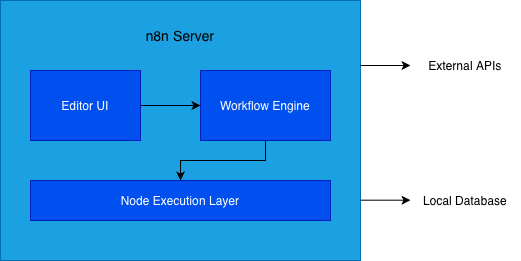
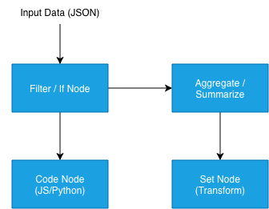
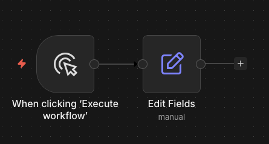
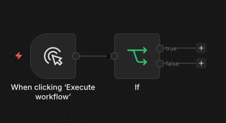
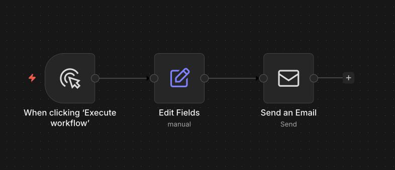
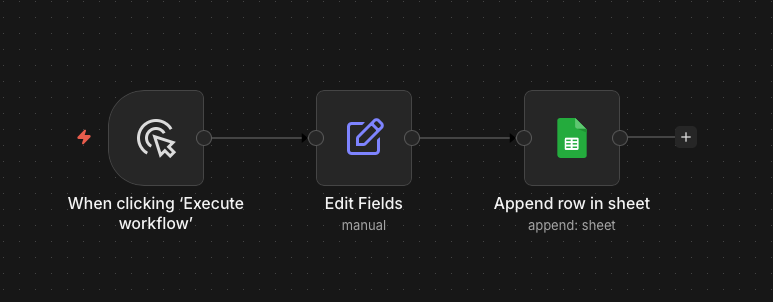
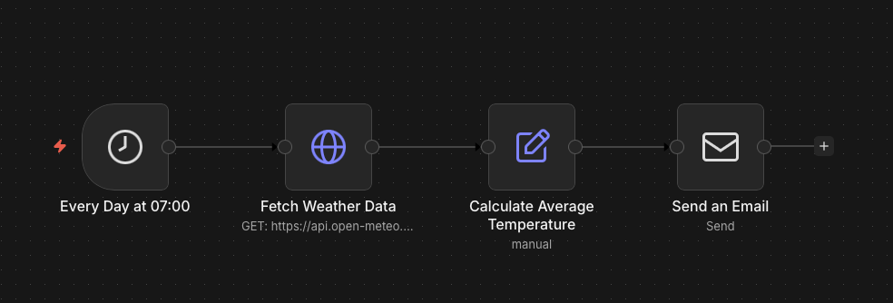
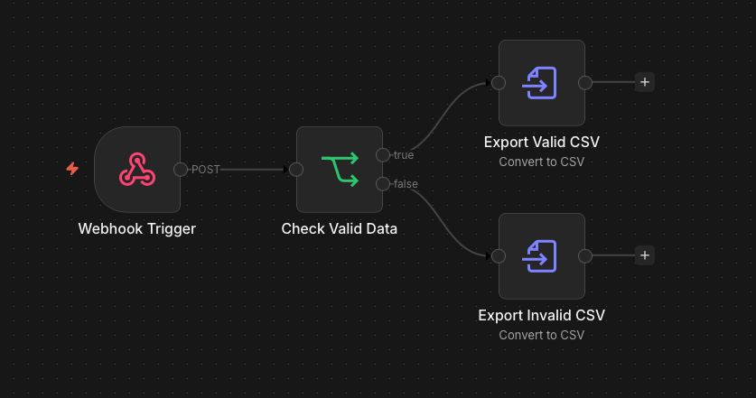
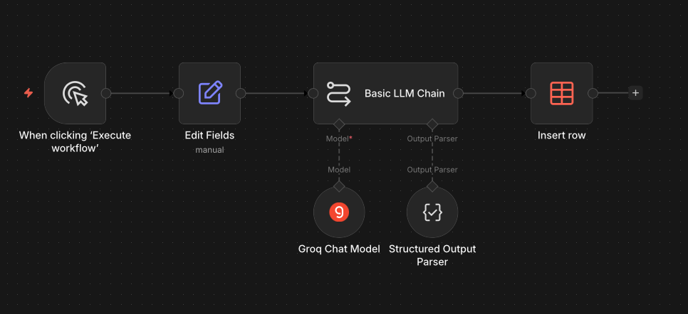
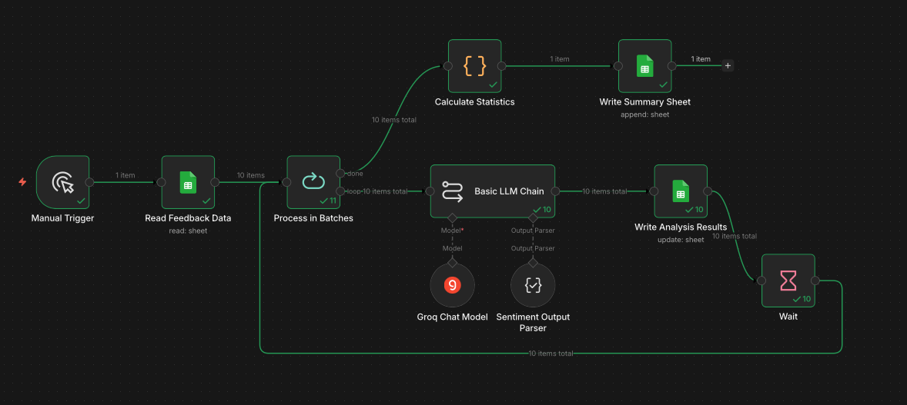

<!-- _class: lead -->

<style scoped>
.logo-bar { position: absolute; top: 36px; right: 64px; display: flex; align-items: center; gap: 16px; }
.logo-bar img { width: 100px; height: 100px; object-fit: contain; }
</style>

<div class="logo-bar">
  
  
</div>

# การอบรมเชิงปฏิบัติการรูปแบบออนไลน์
# เรื่อง การสร้างผู้ช่วยอัจฉริยะ (AI Agent) สำหรับงานสถิติภาครัฐ ด้วย n8n รุ่นที่ 2


ผศ. ดร.ทวีศักดิ์ สมานชื่น
CBTU · คณะวิศวกรรมศาสตร์ · มหาวิทยาลัยมหิดล
วันที่ 22 มิถุนายน 2567

---

## หัวข้อการฝึกอบรม


| Module | หัวข้อ |
|---|---|
| **Module 1** | Introduction AI and Workflow Automation |
| **Module 2** | Introduction to n8n |
| **Module 3** | Workshop: Basic Workflow — Data Table & Google Sheets |
| **Module 4** | Workshop: Statistics Data Pipeline |
| **Module 5** | Workshop: Sentiment Analysis & Satisfaction (100 ชุด) |
| **Module 7** | Workshop: Basic AI Agent on n8n |
| **Module 8** | Workshop: Agent with Tools + Real Data |

**หมายเหตุ**: Module 6 และ 9 ตัดออกเนื่องจากความเหมาะสมกับการอบรมในรูปแบบออนไลน์

---
<!-- footer: "n8n Workflow Automation | Module 1 — Introduction to AI and Workflow Automation | สำนักงานสถิติแห่งชาติ" -->

<!-- _class: lead -->

<style scoped>
.logo-bar { position: absolute; top: 36px; right: 64px; display: flex; align-items: center; gap: 16px; }
.logo-bar img { width: 100px; height: 100px; object-fit: contain; }
</style>

<div class="logo-bar">
  
  
</div>

# Introduction to AI and Workflow Automation

<div class="subtitle">Module 1 — ภาพรวม Workflow Automation สำหรับงานสถิติภาครัฐ</div>

**หลักสูตร** การสร้างผู้ช่วยอัจฉริยะ (AI Agent) สำหรับงานสถิติภาครัฐด้วย n8n 

ผศ. ดร.ทวีศักดิ์ สมานชื่น
CBTU · คณะวิศวกรรมศาสตร์ · มหาวิทยาลัยมหิดล


---

## เนื้อหาใน Module นี้

1. **AI & Automation ในยุคปัจจุบัน** — ภาพรวมและแนวโน้ม
2. **Workflow Automation คืออะไร?** — นิยามและหลักการ
3. **งานสถิติภาครัฐ** — ปัญหาและความท้าทาย
4. **Use Cases** — ตัวอย่างการใช้งานจริง
5. **Tools Ecosystem** — เครื่องมือที่ใช้งานได้
6. **n8n Overview** — ทำไมต้อง n8n?

---

<!-- _class: divider -->

## 01
## AI & Automation ในยุคปัจจุบัน

The Rise of AI-Powered Automation

---

## Automation คืออะไร?

### ระบบอัตโนมัติในบริบทงานข้อมูล

- **Manual Process** — มนุษย์ทำงานทุกขั้นตอนด้วยตนเอง
- **Automation** — ระบบทำงานซ้ำ ๆ แทนมนุษย์โดยอัตโนมัติ
- **AI-Powered Automation** — ระบบตัดสินใจและปรับตัวได้ด้วย AI

> "Automation is not about replacing humans — it's about freeing humans to do more meaningful work."

---

## แนวโน้มระดับโลก

### Digital Transformation ภาครัฐ

- 🌐 **Open Government Data** — ภาครัฐเปิดเผยข้อมูลสู่สาธารณะ
- 📊 **Data-Driven Policy** — นโยบายอิงข้อมูลเชิงประจักษ์
- 🤖 **AI in Public Sector** — ประยุกต์ AI ในกระบวนการราชการ
- ⚡ **Real-time Analytics** — วิเคราะห์ข้อมูลแบบ Real-time

### ไทยกับ Digital Government

- แผน Digital Economy และ Society ของประเทศไทย
- การพัฒนา Data Infrastructure ภาครัฐ

---

<!-- _class: divider -->

## 02
## Workflow Automation คืออะไร?

What is Workflow Automation?

---

## นิยามและหลักการ

### Workflow Automation

**Workflow** = ลำดับขั้นตอนการทำงานที่เชื่อมต่อกัน
**Automation** = การให้ระบบทำงานเหล่านั้นโดยอัตโนมัติ

### ส่วนประกอบหลัก

| ส่วนประกอบ | ความหมาย | ตัวอย่าง |
|---|---|---|
| **Trigger** | สิ่งที่เริ่มต้น Workflow | เวลา, เหตุการณ์, ข้อมูลใหม่ |
| **Action** | งานที่ระบบทำ | ดึงข้อมูล, แปลง, ส่งรายงาน |
| **Integration** | การเชื่อมต่อระบบ | API, Database, Email |

---

## ประโยชน์ของ Workflow Automation

### สำหรับงานสถิติและข้อมูล

- ⏱️ **ประหยัดเวลา** — ลดงาน Manual ที่ทำซ้ำๆ ได้ถึง 80%
- 🎯 **ลด Human Error** — ข้อมูลถูกต้องและสม่ำเสมอมากขึ้น
- 📈 **Scalability** — รองรับข้อมูลปริมาณมากโดยไม่ต้องเพิ่มคน
- 🔄 **Real-time** — ประมวลผลและรายงานได้ทันที
- 💡 **ทรัพยากรมีคุณค่ามากขึ้น** — เจ้าหน้าที่โฟกัสงานที่มีคุณค่าสูง

---

<!-- _class: divider -->

## 03
## งานสถิติภาครัฐ

ปัญหาและความท้าทายในปัจจุบัน

---

## ปัญหาที่พบบ่อยในงานสถิติภาครัฐ

### กระบวนการที่ต้องปรับปรุง

- 📋 **รวบรวมข้อมูลด้วยมือ** — Copy-paste ข้อมูลจากหลายแหล่ง
- 🗂️ **ข้อมูลกระจัดกระจาย** — อยู่ใน Excel, PDF, ระบบต่างๆ
- ⏰ **รายงานล่าช้า** — กว่าจะได้ข้อมูลก็หมดประโยชน์แล้ว
- 🔁 **ทำซ้ำทุกเดือน** — งานเดิมทุกรอบโดยไม่มีการอัตโนมัติ
- ❌ **ข้อมูลผิดพลาด** — Human Error จากการทำด้วยมือ

---

## กระบวนการทำงานสถิติที่พบบ่อย

### Before Automation

```
1. เปิด Excel → 2. ดาวน์โหลดข้อมูลจากหลายแหล่ง (ด้วยมือ)
→ 3. Copy-paste รวมกัน → 4. ทำ Pivot Table
→ 5. สร้าง Chart → 6. ส่ง Email รายงาน
→ (ทำซ้ำทุกเดือน / ทุกสัปดาห์)
```

### After Automation

```
ตั้งเวลา → ระบบดึงข้อมูลอัตโนมัติ → ประมวลผล
→ สร้างรายงาน → ส่งรายงานให้ผู้บริหาร
(ทำงานอัตโนมัติ ไม่ต้องดูแล)
```

---

<!-- _class: divider -->

## 04
## Use Cases

ตัวอย่างการใช้ Workflow Automation ในงานสถิติ

---

## Use Case 1: รายงานสถิติอัตโนมัติ

### Monthly Statistics Report

**ปัญหา:** เจ้าหน้าที่ใช้เวลา 2 วันต่อเดือนรวบรวมข้อมูลสถิติ

**วิธีแก้ด้วย Automation:**
1. **Trigger:** ทุกวันที่ 1 ของเดือน เวลา 08:00
2. **Action 1:** ดึงข้อมูลจากฐานข้อมูลภาครัฐ (API)
3. **Action 2:** คำนวณและสรุปสถิติ
4. **Action 3:** สร้าง Dashboard อัตโนมัติ


**ผล:** ประหยัดเวลา 16 ชั่วโมง/เดือน

---

## Use Case 2: แจ้งเตือนข้อมูลผิดปกติ

### Anomaly Detection Alert

**ปัญหา:** ข้อมูลผิดปกติถูกค้นพบช้า ทำให้รายงานผิดพลาด

**วิธีแก้ด้วย Automation:**
1. **Trigger:** มีข้อมูลใหม่เข้าระบบ
2. **Action 1:** ตรวจสอบความสมเหตุสมผลของข้อมูล
3. **Action 2:** เปรียบเทียบกับค่าเฉลี่ยย้อนหลัง
4. **Action 3:** หากพบความผิดปกติ → แจ้งเตือน LINE/Email

**ผล:** ตรวจพบปัญหาได้เร็วขึ้น จากหลายวัน เหลือไม่กี่นาที

---

## Use Case 3: รวบรวมข้อมูลจากหลายแหล่ง

### Data Aggregation Pipeline

**แหล่งข้อมูลที่พบในงานสถิติภาครัฐ:**

| แหล่งข้อมูล | ประเภท | ความถี่ |
|---|---|---|
| Open Government Data | REST API | รายวัน |
| ฐานข้อมูลภายใน | SQL Database | Real-time |
| ไฟล์ Excel/CSV | File Upload | รายเดือน |
| รายงาน PDF | OCR / Parsing | ราย Quarter |
| แบบสำรวจออนไลน์ | Form API | ต่อเนื่อง |

---

<!-- _class: divider -->

## 05
## Tools Ecosystem

เครื่องมือ Workflow Automation ที่ใช้งานได้

---

## ภาพรวม No-Code / Low-Code Automation Tools

### เปรียบเทียบเครื่องมือยอดนิยม

| Tool | ประเภท | จุดเด่น | เหมาะกับ |
|---|---|---|---|
| **n8n** | Open Source | Self-hosted, Flexible | Developer / IT |
| **Zapier** | Cloud SaaS | ง่าย, เร็ว | Business Users |
| **Make (Integromat)** | Cloud SaaS | Visual, Powerful | Mid-level |
| **Power Automate** | Microsoft | Microsoft 365 | องค์กรที่ใช้ MS |
| **Apache Airflow** | Open Source | Data Pipeline | Data Engineer |

---

## ทำไมต้อง n8n?

### ข้อดีของ n8n สำหรับภาครัฐ

- 🔓 **Open Source & Free** — ไม่มีค่าใช้จ่าย License
- 🏛️ **Self-hosted** — ข้อมูลอยู่ในองค์กร ไม่ออกไปภายนอก
- 🔒 **Data Privacy** — เหมาะกับข้อมูลภาครัฐที่ต้องรักษาความลับ
- 🔌 **400+ Integrations** — เชื่อมต่อได้กับระบบมากมาย
- 💻 **Visual Interface** — สร้าง Workflow ด้วย Drag & Drop
- 🤖 **AI Integration** — รองรับ AI/LLM nodes

---

<!-- _class: divider -->

## 06
## เริ่มต้น Automation

แนวทางการนำ Workflow Automation มาใช้ในองค์กร

---

## Framework การเริ่มต้น Automation

### 3 ขั้นตอนสู่ Automation

**ขั้นที่ 1: Identify**
- รวบรวมงาน Manual ที่ทำซ้ำๆ
- ประเมินเวลาและความถี่

**ขั้นที่ 2: Design**
- วาง Workflow ที่ต้องการ
- กำหนด Trigger, Action, Output


---
## Framework การเริ่มต้น Automation (ต่อ)


**ขั้นที่ 3: Implement & Monitor**
- สร้าง Workflow ด้วย n8n
- ทดสอบและปรับปรุง

---

## Automation Readiness Checklist

### ประเมินความพร้อมของหน่วยงาน

- [ ] มีงาน Manual ที่ทำซ้ำๆ อย่างสม่ำเสมอ
- [ ] ข้อมูลมีโครงสร้างที่ชัดเจน (มี API หรือ Database)
- [ ] มีเจ้าหน้าที่ IT สนับสนุน
- [ ] มี Server หรือ Cloud สำหรับ Deploy n8n
- [ ] ผู้บริหารสนับสนุนการเปลี่ยนแปลง

> **เริ่มเล็กก็ได้** — เลือก Use Case ง่ายๆ 1 อย่างแล้วทดลองทำก่อน

---

<!-- _class: divider -->

## 07
## สรุปและบทเรียนถัดไป

Summary & What's Next

---

## สรุป Module 1

### สิ่งที่เรียนรู้ใน Module นี้

- ✅ **AI & Automation** คืออะไรและมีแนวโน้มอย่างไรในภาครัฐ
- ✅ **Workflow Automation** ช่วยลดงาน Manual และ Human Error
- ✅ **ปัญหางานสถิติภาครัฐ** ที่ Automation ช่วยแก้ได้
- ✅ **Use Cases** หลากหลายที่ประยุกต์ใช้ได้จริง
- ✅ **n8n** เป็นตัวเลือกที่เหมาะกับภาครัฐไทย

### Module ถัดไป

**Module 2:** Introduction to n8n — Interface, Nodes และการตั้งค่าเบื้องต้น


---

<!-- footer: "n8n Workflow Automation | Module 2 — Introduction to n8n | สำนักงานสถิติแห่งชาติ" -->


<!-- _class: lead -->

<style scoped>
.logo-bar { position: absolute; top: 36px; right: 64px; display: flex; align-items: center; gap: 16px; }
.logo-bar img { width: 100px; height: 100px; object-fit: contain; }
</style>

<div class="logo-bar">
  
  
</div>

# Introduction to n8n

<div class="subtitle">Module 2 — รู้จัก n8n: เครื่องมือ Workflow Automation</div>

**หลักสูตร** การสร้างผู้ช่วยอัจฉริยะ (AI Agent) สำหรับงานสถิติภาครัฐด้วย n8n

ผศ. ดร.ทวีศักดิ์ สมานชื่น
CBTU · คณะวิศวกรรมศาสตร์ · มหาวิทยาลัยมหิดล


---

## เนื้อหาใน Module นี้

1. **n8n คืออะไร?** — ประวัติ, ลักษณะ, ความสามารถ
2. **สถาปัตยกรรม n8n** — Self-hosted vs Cloud
3. **Interface ของ n8n** — ทำความคุ้นเคยกับ UI
4. **Node Types** — ประเภทของ Nodes ต่างๆ
5. **Credentials & Connections** — การเชื่อมต่อบริการภายนอก
6. **Data Flow** — ข้อมูลไหลอย่างไรใน n8n

---

<!-- _class: divider -->

<style scoped>
.n8n-logo { position: absolute; right: 100px; top: 50%; transform: translateY(-50%); width: 520px; object-fit: contain; }
</style>

## 01
## n8n คืออะไร?

What is n8n?


---

## รู้จัก n8n

### n8n — Workflow Automation Platform

- **ชื่อ:** n8n (อ่านว่า "n eight n")
- **ปีที่เริ่มต้น:** 2019 โดย Jan Oberhauser
- **License:** Fair-code (Source Available)
- **GitHub:** github.com/n8n-io/n8n
- **Integrations:** 400+ บริการและ API

### คำขวัญ
> "Build complex automations 10x faster, without fighting APIs"

---

## ความสามารถหลักของ n8n

### Core Features

| ความสามารถ | รายละเอียด |
|---|---|
| **Visual Workflow Builder** | Drag & Drop ไม่ต้องเขียนโค้ด |
| **Code Node** | เขียน JavaScript/Python ได้เมื่อต้องการ |
| **Trigger Nodes** | Webhook, Schedule, Event-based |
| **400+ Integrations** | APIs, Databases, Apps |
| **AI Nodes** | LangChain, OpenAI, Ollama |
| **Self-hosted** | ควบคุมข้อมูลได้ 100% |

---

## n8n เทียบกับเครื่องมืออื่น

### ข้อดีที่โดดเด่น

```
Zapier          → ง่าย แต่แพง และข้อมูลผ่าน Cloud
Make            → ดี แต่ค่าใช้จ่ายตาม Operation
Power Automate  → ดีสำหรับ Microsoft แต่ Lock-in
─────────────────────────────────────────────
n8n             → Open Source + Self-hosted
                  ข้อมูลอยู่ในองค์กร
                  ไม่มีค่าใช้จ่าย License
                  ยืดหยุ่นสูง + Custom Code
```

---

<!-- _class: divider -->

## 02
## สถาปัตยกรรม n8n

n8n Architecture & Deployment

---

## วิธีติดตั้ง n8n

### ตัวเลือกการ Deploy

<div class="columns">
<div>

**Option 1: Docker (แนะนำสำหรับภาครัฐ)**
```bash
docker run -it --rm \
  --name n8n \
  -p 5678:5678 \
  -v ~/.n8n:/home/node/.n8n \
  n8nio/n8n
```

</div>
<div>

**Option 2: npm**
```bash
npm install n8n -g
n8n start
```

**Option 3: n8n Cloud** (เหมาะกับการเรียน)
n8n.io (ต้องการ Subscription)

</div>
</div>

---

## สถาปัตยกรรมภายใน

<div class="center">



</div>

---

<!-- _class: divider -->

## 03
## Interface ของ n8n

Getting Familiar with n8n UI

---

## ส่วนประกอบหลักของ UI
<div class="columns">
<div>

### หน้า Dashboard หลัก

- 📋 **Workflows** — รายการ Workflow ทั้งหมด
- 🔑 **Credentials** — จัดการการเชื่อมต่อ API/Service
- ⚙️ **Settings** — ตั้งค่าระบบ
- 📊 **Executions** — ประวัติการรัน Workflow
</div>
<div>

### Editor Canvas

- **Node Panel** — รายการ Nodes ทั้งหมด (ด้านซ้าย)
- **Canvas** — พื้นที่วาง Workflow (ตรงกลาง)
- **Node Settings** — ตั้งค่า Node ที่เลือก (ด้านขวา)
- **Execution Log** — ผลการรัน (ด้านล่าง)
</div>
</div>

---

## การใช้ Canvas

### Keyboard Shortcuts ที่ใช้บ่อย

| คำสั่ง | Shortcut |
|---|---|
| เพิ่ม Node ใหม่ | `Tab` หรือ คลิก `+` |
| บันทึก Workflow | `Ctrl/Cmd + S` |
| รัน Workflow | `Ctrl/Cmd + Enter` |
| Zoom In/Out | `Ctrl/Cmd + Scroll` |
| Select All | `Ctrl/Cmd + A` |
| ลบ Node | `Delete` / `Backspace` |
| Duplicate Node | `Ctrl/Cmd + D` |

---

<!-- _class: divider -->

## 04
## Node Types

ประเภท Nodes ใน n8n

---

## ประเภทของ Nodes

### Trigger Nodes — จุดเริ่มต้นของ Workflow

| Node | การทำงาน |
|---|---|
| **Schedule Trigger** | รันตามเวลาที่กำหนด (cron) |
| **Webhook** | รับ HTTP Request จากภายนอก |
| **Manual Trigger** | รันด้วยตนเอง (สำหรับทดสอบ) |
| **Email Trigger (IMAP)** | ทำงานเมื่อได้รับอีเมล |
| **File Trigger** | ทำงานเมื่อมีไฟล์ใหม่ |

---

## Action Nodes ที่ใช้บ่อย

### สำหรับงานสถิติและข้อมูล

| Node | การใช้งาน |
|---|---|
| **HTTP Request** | เรียก REST API ต่างๆ |
| **Code** | เขียน JavaScript / Python |
| **Set** | กำหนดค่าตัวแปร |
| **IF / Switch** | เงื่อนไขการทำงาน |
| **Merge / Split** | รวมหรือแยกข้อมูล |
| **Spreadsheet File** | อ่าน/เขียน Excel/CSV |
| **Send Email** | ส่งอีเมลรายงาน |
| **Postgres / MySQL** | เชื่อมต่อฐานข้อมูล |

---

## Data Transformation Nodes

<div class="center">



</div>


---

<!-- _class: divider -->

## 05
## Credentials & Connections

การตั้งค่าการเชื่อมต่อบริการภายนอก

---

## Credentials คืออะไร?

### การจัดการ API Keys และ Authentication

- **Credentials** = ข้อมูลการยืนยันตัวตนสำหรับบริการภายนอก
- n8n เข้ารหัส Credentials ด้วย AES-256
- สร้างครั้งเดียว ใช้ได้กับ Workflow ทุกอัน

---

## Credentials คืออะไร? (ต่อ)
### ประเภท Authentication ที่รองรับ

| ประเภท | ตัวอย่าง |
|---|---|
| **API Key** | Most REST APIs |
| **OAuth2** | Google, Microsoft |
| **Basic Auth** | Username + Password |
| **Bearer Token** | JWT APIs |
| **Custom Header** | Custom APIs |

---

## การตั้งค่า Credentials

### ขั้นตอนการเพิ่ม Credential

1. ไปที่ **Settings → Credentials → Add Credential**
2. ค้นหาบริการที่ต้องการ (เช่น HTTP Request, Gmail)
3. กรอกข้อมูล API Key หรือ OAuth
4. กด **Save & Test** เพื่อทดสอบ
5. ใช้ Credential นี้ใน Workflow ได้ทันที

> **ข้อควรระวัง:** อย่าเก็บ API Key ไว้ใน Node Parameters โดยตรง ใช้ Credentials เสมอ

---

<!-- _class: divider -->

## 06
## Data Flow ใน n8n

How Data Flows Through n8n

---

## โครงสร้างข้อมูลใน n8n

### n8n ใช้ JSON เป็นรูปแบบข้อมูลหลัก

```json
{
  "json": {
    "id": 1,
    "name": "สำมะโนประชากร 2566",
    "value": 71480000,
    "province": "กรุงเทพมหานคร"
  },
  "binary": {}
}
```

---
## โครงสร้างข้อมูลใน n8n (ต่อ)

- ข้อมูลไหลเป็น **Array of Items**
- แต่ละ Item มี `json` และ `binary` property
- Nodes รับ → ประมวลผล → ส่งต่อ Items

---

## Expression Language

### การอ้างอิงข้อมูลใน n8n

```
{{ $json.fieldName }}           → ค่าจาก Node ปัจจุบัน
{{ $node["NodeName"].json.x }}  → ค่าจาก Node อื่น
{{ $now }}                      → เวลาปัจจุบัน
{{ $today }}                    → วันที่วันนี้
{{ $itemIndex }}                → ลำดับของ Item
```

### ตัวอย่างการใช้งาน

```
URL: https://api.example.com/data/{{ $json.year }}
Body: { "province": "{{ $json.provinceName }}" }
```

---

<!-- _class: divider -->

## 07
## สรุปและบทเรียนถัดไป

Summary & What's Next

---

## สรุป Module 2

### สิ่งที่เรียนรู้ใน Module นี้

- ✅ **n8n** คืออะไร ความสามารถหลัก และข้อดีในบริบทภาครัฐ
- ✅ **สถาปัตยกรรม** และวิธีการ Deploy n8n
- ✅ **Interface** ส่วนประกอบต่างๆ ของ n8n Editor
- ✅ **Node Types** — Trigger, Action, Transform
- ✅ **Credentials** — การจัดการ API Keys อย่างปลอดภัย
- ✅ **Data Flow** — ข้อมูล JSON ไหลอย่างไรใน n8n

### Module ถัดไป

**Module 3:** Workshop — สร้าง Workflow พื้นฐานด้วย n8n


---

<!-- footer: "n8n Workflow Automation | Module 3 — Workshop: Workflow พื้นฐาน | สำนักงานสถิติแห่งชาติ" -->


<!-- _class: lead -->

<style scoped>
.logo-bar { position: absolute; top: 36px; right: 64px; display: flex; align-items: center; gap: 16px; }
.logo-bar img { width: 100px; height: 100px; object-fit: contain; }
</style>

<div class="logo-bar">
  
  
</div>

# Workshop: สร้าง Workflow พื้นฐานด้วย n8n

<div class="subtitle">Module 3 — เชื่อมต่อข้อมูลและสร้าง Workflow แรก</div>

**หลักสูตร** การสร้างผู้ช่วยอัจฉริยะ (AI Agent) สำหรับงานสถิติภาครัฐด้วย n8n

ผศ. ดร.ทวีศักดิ์ สมานชื่น
CBTU · คณะวิศวกรรมศาสตร์ · มหาวิทยาลัยมหิดล


---

## เนื้อหาใน Module นี้

1. **Setup & Hello World** — สร้าง Workflow แรก
2. **Trigger Nodes** — Schedule และ Manual Trigger
3. **HTTP Request** — เรียกข้อมูลจาก API
4. **Data Transformation** — Set, IF, Code Nodes
5. **Output** — ส่ง Email และบันทึกไฟล์
6. **Workshop Exercise** — ฝึกปฏิบัติ

---

<!-- _class: divider -->

## 01
## Hello World Workflow

สร้าง Workflow แรกของคุณ


---
## Demo 1: Workflow แรก

<div class="center">


</div>

---

## Demo 1: Workflow แรก

### เป้าหมาย: แสดงข้อความ "Hello Statistics!"

**ขั้นตอน:**

1. คลิก **"New Workflow"** บน Dashboard
2. คลิก `+` บน Canvas เพื่อเพิ่ม Node
3. ค้นหา **"Manual Trigger"** → เพิ่ม
4. คลิก `+` ต่อจาก Manual Trigger
5. เพิ่ม **"Set"** Node
6. เพิ่ม Field: `message` = `Hello Statistics!`
7. กด **"Execute Workflow"** เพื่อรัน

---

## ผลลัพธ์ที่ควรเห็น: Output จาก Set Node

```json
[
  {
      "message": "Hello Statistics!"
  }
]
```

### สิ่งที่เรียนรู้

- วิธีสร้าง Workflow ใหม่
- การเพิ่มและเชื่อม Nodes
- การดู Output ของ Nodes

---

<!-- _class: divider -->

## 02
## Trigger Nodes

เริ่มต้น Workflow ด้วย Triggers


---
## Trigger Nodes

<div class="center">


</div>

---

## Schedule Trigger :  รัน Workflow ตามเวลาที่กำหนด

**การตั้งค่า:**
- **Mode:** Every X minutes / hours / days
- **Cron Expression:** สำหรับตั้งเวลาซับซ้อน

| Cron | ความหมาย |
|---|---|
| `0 8 * * 1-5` | ทุกวันทำงาน เวลา 08:00 |
| `0 9 1 * *` | วันที่ 1 ทุกเดือน เวลา 09:00 |
| `0 */4 * * *` | ทุก 4 ชั่วโมง |
| `0 7 * * 1` | ทุกวันจันทร์ เวลา 07:00 |

---

## Webhook Trigger

### รับข้อมูลจากระบบภายนอก

**ใช้เมื่อ:** ต้องการรับ Event จากระบบอื่น เช่น:
- ระบบสำรวจส่งข้อมูลเข้ามา
- แบบฟอร์มออนไลน์ Submit
- ระบบอื่น Push ข้อมูลให้

**Webhook URL ตัวอย่าง:**
```
https://your-n8n.domain.go.th/webhook/stats-data
```

**การทดสอบ:** ใช้ **Test URL** ใน n8n Editor ก่อน Activate

---

<!-- _class: divider -->

## 03
## HTTP Request Node

เรียกข้อมูลจาก REST API


---
## HTTP Request พื้นฐาน

### Demo 2: ดึงข้อมูลจาก Open Data API

<div class="center">


</div>

---

## HTTP Request พื้นฐาน

### Demo 2: ดึงข้อมูลจาก Open Data API

**เป้าหมาย:** เรียกข้อมูลจาก JSONPlaceholder (API ตัวอย่าง)

**การตั้งค่า HTTP Request Node:**
```
Method:  GET
URL:     https://jsonplaceholder.typicode.com/posts
Headers: (ว่าง)
```

**ผลลัพธ์:** รายการโพสต์ 100 รายการในรูปแบบ JSON

---

## HTTP Request กับ Query Parameters

```
Method: GET
URL:    https://api.example.go.th/statistics
```

**Query Parameters (เพิ่มใน n8n):**

| Name | Value |
|---|---|
| `year` | `{{ $now.year }}` |
| `province` | `all` |
| `format` | `json` |

**URL ที่ได้:** https://api.example.go.th/statistics?year=2567&province=all&format=json

---

## HTTP Request กับ Authentication: การส่ง API Key

**ผ่าน Header:**
```
Header Name:  Authorization
Header Value: Bearer {{ $credentials.apiKey }}
```

**ผ่าน Query Parameter:**
```
Parameter Name:  api_key
Parameter Value: (เลือกจาก Credentials)
```

> **Best Practice:** สร้าง Credential ใน n8n เสมอ อย่า Hardcode API Key ใน Node

---

<!-- _class: divider -->

## 04
## Data Transformation

แปลงและกรองข้อมูลใน n8n

---

## Set Node — กำหนดค่าตัวแปร

### การใช้ Set Node

**Demo 3: สร้างข้อมูลสรุปอย่างง่าย**

```
Field: report_title    → "รายงานสถิติประจำเดือน"
Field: report_date     → {{ $today }}
Field: data_source     → {{ $json.source }}
Field: total_records   → {{ $json.count }}
```



---

## IF Node — เงื่อนไขการทำงาน


**Demo 4: ตรวจสอบค่าผิดปกติ**

```
Condition: {{ $json.value }} > 1000000
```
**True Branch** → ส่งแจ้งเตือนว่าข้อมูลสูงผิดปกติ
**False Branch** → ดำเนินการปกติต่อไป

### เงื่อนไขที่รองรับ
- Equal / Not Equal
- Larger / Smaller than
- Contains / Starts With

---

## Code Node — เขียน Custom Logic

<div class="columns">
<div>

**Code Node: คำนวณ % การเปลี่ยนแปลง**

```javascript
const items = $input.all();
return items.map(item => {
  const current = item.json.current_value;
  const previous = item.json.previous_value;
  const change = ((current - previous) / 
                  previous * 100).toFixed(2);

```

</div>
<div>

```javascript
  return {
    json: {
      ...item.json,
      percent_change: parseFloat(change),
      trend: change > 0 ? "เพิ่มขึ้น" : "ลดลง"
    }
  };
});
```
</div>
</div>

---

## Filter / Split in Batches

<div class="columns">
<div>

**Filter Node** — กรองข้อมูลตามเงื่อนไข
```
เก็บเฉพาะ: {{ $json.province }} == "กรุงเทพมหานคร"
```

**Split in Batches** — แบ่งประมวลผลทีละ N รายการ
- ป้องกัน API Rate Limit
- ประมวลผลข้อมูลขนาดใหญ่ได้

</div>
<div>

**Merge Node** — รวมข้อมูลจากหลาย Branch
- Merge by Position
- Merge by Key (JOIN ข้อมูล 2 ชุด)

</div>
</div>

---

<!-- _class: divider -->

## 05
## Output: Email & File

ส่งออกผลลัพธ์

---

## Send Mail
### Demo 5: ส่งรายงานทาง Email

<div class="center">



</div>

---

## ส่งรายงานทาง Email

<div class="columns">
<div>

### Send Email Node (SMTP)

**การตั้งค่า Credential:**
- Protocol: SMTP / Gmail / Outlook
- Host, Port, Username, Password

**Attachment:** แนบไฟล์ CSV/Excel ได้

</div>
<div>

**การตั้งค่า Email Node:**
```
To:      director@nso.go.th
Subject: รายงานสถิติ {{ $today }} อัตโนมัติ
Body:    ยอดรวมประจำวันนี้: {{ $json.total }}
         ดูรายละเอียดที่ระบบ Dashboard
```

</div>
</div>


---

## Google Sheet
### Demo 6: บันทึกข้อมูลลง Google Sheets

<div class="center">



</div>

---

## บันทึกข้อมูลลง Google Sheets

<div class="columns">
<div>

### Google Sheets Node

**การตั้งค่า Credential:**
- Google OAuth2 หรือ Service Account
- แชร์ Sheet ให้ Service Account Email

**Operation:**
- **Append** — เพิ่มข้อมูลแถวใหม่
- **Update** — อัปเดตแถวที่มีอยู่
- **Read** — ดึงข้อมูลจาก Sheet

</div>
<div>

**การตั้งค่า Node:**
```
Operation:    Append
Document ID:  (วาง Google Sheet URL)
Sheet Name:   Sheet1

Columns:
  date     → {{ $today }}
  total    → {{ $json.total }}
  province → {{ $json.province }}
```

</div>
</div>


---

<!-- _class: divider -->

## 06
## Workshop 

ฝึกปฏิบัติ

---

<!-- _class: highlight -->

## Workshop A — รายงานอากาศอัตโนมัติ

<div class="columns">
<div>

### โจทย์

สร้าง Workflow ที่:
1. **ทำงานทุกเช้า** เวลา 07:00 น.
2. **ดึงข้อมูลอากาศ** จาก Open-Meteo API (Free, ไม่ต้องใช้ API Key)
3. **แปลงข้อมูล** — คำนวณค่าเฉลี่ยอุณหภูมิ
4. **ส่ง Email** สรุปสภาพอากาศประจำวัน

</div>
<div>

### API ที่ใช้

```
URL: https://api.open-meteo.com/v1/forecast
Parameters:
  latitude=13.75
  longitude=100.52
  daily=temperature_2m_max,
        temperature_2m_min
  timezone=Asia/Bangkok
```

</div>
</div>

---
## Hint: Workflow for Workshop A

<div class="center">



</div>

---

<!-- _class: highlight -->

## Workshop B — Data Cleaning Pipeline

<div class="columns">
<div>

### โจทย์

สร้าง Workflow ที่:
1. **รับข้อมูล** จาก Webhook (จำลองการส่งข้อมูลสำรวจ)
2. **ตรวจสอบ** ว่าข้อมูลครบถ้วน (ไม่มีค่า null)
3. **แยก** ข้อมูล valid / invalid ออกจากกัน
4. **บันทึก** ลงไฟล์ CSV แยก: `valid.csv` และ `invalid.csv`

</div>
<div>

### สิ่งที่ต้องทำ

1. สร้าง Webhook Trigger
2. ใช้ IF Node ตรวจสอบ required fields
3. True Branch → Export `valid.csv` ด้วย Spreadsheet File Node
4. False Branch → Export `invalid.csv` ด้วย Spreadsheet File Node

> **Dataset:** ทดสอบด้วย Postman หรือ curl

</div>
</div>


---
## Hint: Workflow for Workshop B

<div class="center">



</div>

---
## curl for testing
```bash
curl -X POST "https://itmmu.app.n8n.cloud/webhook-test/survey-data" \
  -H "Content-Type: application/json" \
  -d '{
    "name": "Ake",
    "email": "ake@example.com",
    "feedback": "This is my feedback"
  }'
```


---

## สรุป Module 3

### สิ่งที่เรียนรู้ใน Module นี้

- ✅ **สร้าง Workflow** ตั้งแต่ต้นด้วย Manual & Schedule Trigger
- ✅ **HTTP Request** เรียก REST API พร้อม Authentication
- ✅ **Data Transformation** — Set, IF, Code, Filter Nodes
- ✅ **Output** — ส่ง Email และ Export ไฟล์ Excel/CSV
- ✅ **Workshop** — ฝึกสร้าง Workflow จริงด้วยข้อมูลจริง

### Module ถัดไป

**Module 4:** Workshop — สร้าง Workflow ดึงและประมวลผลข้อมูลสถิติอัตโนมัติ


---

<!-- footer: "n8n Workflow Automation | Module 4 — Workshop: ข้อมูลสถิติอัตโนมัติ | สำนักงานสถิติแห่งชาติ" -->


<!-- _class: lead -->

<style scoped>
.logo-bar { position: absolute; top: 36px; right: 64px; display: flex; align-items: center; gap: 16px; }
.logo-bar img { width: 100px; height: 100px; object-fit: contain; }
</style>

<div class="logo-bar">
  
  
</div>

# Workshop: ดึงและประมวลผลข้อมูลสถิติอัตโนมัติ

<div class="subtitle">Module 4 — End-to-End Statistics Data Pipeline</div>

**หลักสูตร** การสร้างผู้ช่วยอัจฉริยะ (AI Agent) สำหรับงานสถิติภาครัฐด้วย n8n

ผศ. ดร.ทวีศักดิ์ สมานชื่น
CBTU · คณะวิศวกรรมศาสตร์ · มหาวิทยาลัยมหิดล

---

## วัตถุประสงค์การเรียนรู้

เมื่อจบ module นี้ ผู้เรียนสามารถ:

1. **ออกแบบ** Pipeline ดึงข้อมูลสถิติจากแหล่งข้อมูลภาครัฐ
2. **ประมวลผล** และ **สรุป** ข้อมูลสถิติอัตโนมัติ
3. **ตั้งเวลา** ให้ระบบทำงานอัตโนมัติแบบ Scheduled
4. **สร้าง** รายงานสรุปและส่งให้ผู้บริหารอัตโนมัติ
5. **จัดการ** Error Handling และ Monitoring

---

## เนื้อหาใน Module นี้

1. **ภาพรวม Pipeline** — Architecture ของระบบ
2. **แหล่งข้อมูลสถิติภาครัฐ** — Open Data APIs ไทย
3. **Data Extraction** — ดึงข้อมูลจาก Multiple Sources
4. **Data Processing** — ประมวลผลและสรุปข้อมูล
5. **Reporting & Alerting** — รายงานและแจ้งเตือน
6. **Workshop** — สร้าง Full Pipeline

---

<!-- _class: divider -->

## 01
## Architecture ภาพรวม

Statistics Data Pipeline Design

---

## Pipeline Architecture

### End-to-End Data Pipeline


<div class="center">


</div>

---

## แหล่งข้อมูลที่จะใช้ใน Workshop

### Open Data APIs สำหรับงานสถิติไทย

| แหล่งข้อมูล | URL | ประเภทข้อมูล |
|---|---|---|
| **data.go.th** | api.data.go.th | Open Government Data |
| **Data Catalog** | catalog.nso.go.th | สถิติเศรษฐกิจ |
| **BOT** | api.bot.or.th | ข้อมูลการเงิน |
| **DDC** | covid19.ddc.moph.go.th | สุขภาพ |
| **Open-Meteo** | api.open-meteo.com | สภาพอากาศ (Free) |

---

<!-- _class: divider -->

## 02
## แหล่งข้อมูลสถิติภาครัฐ

ระบบบัญชีข้อมูลสำนักงานสถิติแห่งชาติ NSO Data Catalog

---

## [catalog.nso.go.th](https://catalog.nso.go.th)

<div class="columns">
<div>

### การเข้าถึงข้อมูลภาครัฐ

**ขั้นตอนการใช้งาน:**
1. ค้นหา Dataset ที่ต้องการ
2. ดู API Documentation ของ Dataset นั้น

</div>
<div>

**ตัวอย่าง API Call:**
```
GET https://catalog.nso.go.th/api/3/action/datastore_search
    ?resource_id=a2443986-6b68-4f44-a94b-b84b0fc50c96
    &limit=100
```

</div>
</div>

---

## ตัวอย่าง: รายได้เฉลี่ยต่อเดือนของครัวเรือน (NSO)

**CKAN API (NSO Catalog):**
```
GET https://catalog.nso.go.th/api/3/action/datastore_search
    ?resource_id=a2443986-6b68-4f44-a94b-b84b0fc50c96
    &limit=100
```

**Columns ที่ได้:** `YEAR`, `REGION`, `AREA`, `MONTHLY_INCOME`, `FROM_WORK`, `PROPERTY_INCOME`, `CURRENT_TRANSFER`, `NONMONEY_INCOME`

**ผลลัพธ์:** รายได้เฉลี่ยต่อเดือนของครัวเรือน จำแนกตามภาคและพื้นที่ (พ.ศ. 2500–2562)


---

<!-- _class: divider -->

## 03
## Data Processing

ประมวลผลและทำความสะอาดข้อมูล

---

## Data Cleaning Pipeline

### ขั้นตอนการทำความสะอาดข้อมูล


<div class="center">


</div>

---
<!-- _class: dense -->
## Code Node: Data Cleaning

<div class="columns">
<div>

### ขั้นตอน

1. **กรอง** ข้อมูลที่ไม่ครบ
2. **แปลงชนิด** String → Number/Date
3. **ตรวจค่า** ที่ไม่สมเหตุสมผล

> Input: JSON จาก HTTP Request
> Output: Array ของ Items ที่สะอาด

</div>
<div>

```javascript
const items = $input.all();
return items
  .filter(item =>
    item.json.province &&
    item.json.value !== null)
  .map(item => ({
    json: {
      province: item.json.province.trim(),
      value: parseFloat(item.json.value) || 0,
      year: parseInt(item.json.year),
      updated_at: new Date().toISOString()
    }
  }))
  .filter(item =>
    item.json.value >= 0 &&
    item.json.year >= 2500);
```

</div>
</div>

---
<!-- _class: dense -->
## Code Node:  Data Aggregation

<div class="columns">
<div>

### สิ่งที่คำนวณได้

| ค่า | วิธีคำนวณ |
|---|---|
| `total` | รวมทุก record |
| `avg` | total ÷ จำนวน |
| `max` / `min` | ค่าสูง/ต่ำสุด |
| `by_region` | groupBy ภาค |

</div>
<div>

```javascript
const data = $input.all()
  .map(i => i.json);
const values = data.map(d => d.value);
const total = values.reduce((a,b) => a+b, 0);
const avg   = total / values.length;
const max   = Math.max(...values);
const min   = Math.min(...values);
const byRegion = data.reduce((acc, item) => {
  acc[item.region] =
    (acc[item.region] || 0) + item.value;
  return acc;
}, {});
return [{ json: { total, avg, max, min,
                  by_region: byRegion } }];
```

</div>
</div>

---

## Join ข้อมูลจากหลายแหล่ง

### Merge Node — รวมข้อมูล 2 ชุด

**กรณีการใช้งาน:** รวมข้อมูลประชากร + ข้อมูล GDP ต่อจังหวัด

```
[Population API] ──┐
                   ├──► [Merge Node] ──► [Code: คำนวณ GDP/capita]
[GDP API]        ──┘     (Join by "province_code")
```

**การตั้งค่า Merge Node:**
- **Mode:** Combine
- **Combine By:** Matching Rules
- **Fields to Match:** `province_code` = `province_code`

---

<!-- _class: divider -->

## 04
## Reporting & Alerting

สร้างรายงานและระบบแจ้งเตือน

---

## สร้างรายงาน Excel อัตโนมัติ

### Workflow: Monthly Report Generation


<div class="center">


</div>


---

<!-- _class: dense -->

## Template รายงาน HTML Email

<div class="columns">
<div>

**โครงสร้าง Email:**
- `<h2>` — หัวข้อรายงาน
- `<table>` — ตารางข้อมูล
- Header row สี `#1B4F72`
- ใส่ n8n expressions `{{ }}` ในแต่ละ cell

> ใช้ใน **Send Email Node**
> ช่อง Body → HTML mode

</div>
<div>

```html
<h2>รายงานสถิติ {{ $json.month }}</h2>
<table border="1"
  style="border-collapse:collapse;width:100%">
  <tr style="background:#1B4F72;color:white">
    <th>ตัวชี้วัด</th>
    <th>ค่า</th>
    <th>เปลี่ยนแปลง</th>
  </tr>
  <tr>
    <td>รายได้เฉลี่ย (บาท/เดือน)</td>
    <td>{{ $json.avg_income }}</td>
    <td>{{ $json.income_change }}%</td>
  </tr>
</table>
```

</div>
</div>

---


## ระบบแจ้งเตือนความผิดปกติ : Psuedo Code

```
สำหรับแต่ละ item:
  คำนวณ pct = |value - previous| / previous × 100
  ถ้า pct > threshold:
    สร้าง alert:
      - indicator = ชื่อตัวชี้วัด
      - message   = "เปลี่ยนแปลง X%"
      - severity  = HIGH  (ถ้า pct > threshold × 2)
                    MEDIUM (อื่นๆ)
    เพิ่มเข้า alerts[]
ถ้า alerts ไม่ว่าง → return alerts
ไม่มี alert        → return { no_alerts: true }
```

---

## Integration กับช่องทางอื่น

<div class="columns">
<div>

**LINE Notify:**
```
POST https://notify-api.line.me/api/notify
Header: Authorization: Bearer {LINE_TOKEN}
Body:   message={{ $json.message }}
```

**Slack:**
- ใช้ Slack Node ใน n8n โดยตรง

</div>
<div>

**Microsoft Teams (Webhook):**
```json
POST https://your-org.webhook.office.com/...
{
  "text": "รายงานสถิติประจำวัน\n{{ $json.summary }}"
}
```

</div>
</div>

---

<!-- _class: divider -->

## 05
## Workshop Exercise

สร้าง Full Statistics Pipeline

Link Github Repository: [https://github.com/toche7/n8nNSO](https://github.com/toche7/n8nNSO)

---

<!-- _class: highlight -->

## Workshop A — Population Statistics Pipeline

### โจทย์: สร้าง Automated Pipeline **Dataset:** ข้อมูลประชากรจากสำนักงานสถิติแห่งชาติ (NSO)
```
GET https://catalog.nso.go.th/api/3/action/datastore_search
    ?resource_id=57ff7cd9-27e3-4dc5-b6ad-e8280ab18a05&limit=5000
```

1. ดึงข้อมูลประชากรรายจังหวัดจาก NSO Open Data API
2. กรองเฉพาะข้อมูลรวมรายจังหวัด (area=รวม, sex=รวม, age_group=รวม)
3. คำนวณ: ค่าเฉลี่ย, สูงสุด, ต่ำสุด, รวมทั้งประเทศ
4. แยกข้อมูล TOP 5 และ BOTTOM 5 จังหวัดตามจำนวนประชากร
5. Export เป็น Excel Report และส่ง Email สรุปอัตโนมัติ

---

## โครงสร้างข้อมูล NSO Dataset


| ฟิลด์ | ชนิด | ตัวอย่างค่า | ความหมาย |
|---|---|---|---|
| `year` | numeric | `2533`, `2543`, `2553` | ปีพุทธศักราช |
| `region` | text | `ทั่วประเทศ`, `กลาง` | ภาค |
| `province` | text | `รวม`, `กรุงเทพมหานคร` | จังหวัด |
| `area` | text | `รวม`, `ในเขตเทศบาล` | ประเภทพื้นที่ |
| `sex` | text | `รวม`, `ชาย`, `หญิง` | เพศ |
| `age_group` | text | `รวม`, `0-4` | กลุ่มอายุ |
| `value` | numeric | `54548530` | จำนวนประชากร (คน) |

> **Total records: 38,720** | **ปีข้อมูล:** พ.ศ. 2533–ปัจจุบัน

---
<!-- _class: dense -->
## Hint: ขั้นตอนที่ 1 — HTTP Request Node

### ตั้งค่า HTTP Request (ระบุปีที่ต้องการ)

**วิธีที่ 1 — Query String (เร็ว, Filter ฝั่ง Server):**
```
Method:  GET
URL:     https://catalog.nso.go.th/api/3/action/datastore_search
         ?resource_id=57ff7cd9-27e3-4dc5-b6ad-e8280ab18a05
         &limit=5000&filters={"year":2563}
```


---
<!-- _class: dense -->
## Hint: Workshop A

### Workflow Structure

<div class="center">


</div>


---

<!-- _class: highlight -->

## Workshop B — Household Finance Analysis Pipeline

### โจทย์: วิเคราะห์ฐานะทางการเงินครัวเรือนไทยจาก NSO Open Data


| | Dataset | resource_id |
|---|---|---|
| **ชุดที่ 1** | ค่าใช้จ่ายเฉลี่ยต่อเดือนของครัวเรือน จำแนกตามประเภทค่าใช้จ่าย | `697c9b29-d937-4c4e-9d9f-122ff085488b` |
| **ชุดที่ 2** | หนี้สินเฉลี่ยต่อครัวเรือน จำแนกตามวัตถุประสงค์การกู้ยืม | `89cc71ae-f596-4307-b38f-10d61d084801` |

**ความต้องการ:**
1. ดึงข้อมูลจาก 2 API พร้อมกัน (Parallel)
2. คำนวณ **สัดส่วนหนี้สิน/ค่าใช้จ่าย** จำแนกตามสถานะทางเศรษฐสังคม
3. หาจังหวัดที่มีภาระหนี้สูงสุด / ต่ำสุด
4. สร้าง Summary Report ส่ง Email อัตโนมัติ

---

## โครงสร้างข้อมูล: ชุดที่ 1 — ค่าใช้จ่ายครัวเรือน

**Resource ID:** `697c9b29-d937-4c4e-9d9f-122ff085488b` | **Total: 10,780 records** | **ปีข้อมูล:** 2566

| ฟิลด์ | ชนิด | ตัวอย่างค่า |
|---|---|---|
| `year` | text | `"2566"` |
| `province` | text | `"กรุงเทพมหานคร"`, `"เชียงใหม่"` |
| `soc_eco_class1` | text | `"ลูกจ้าง"`, `"ผู้ประกอบธุรกิจ..."`, `"ผู้ถือครองทำการเกษตร..."` |
| `soc_eco_class2` | text | รายละเอียดสถานะ เช่น `"ผู้จัดการนักวิชาการ..."` |
| `type_expenditure1` | text | `"ค่าใช้จ่ายเพื่อการอุปโภคบริโภค"` / `"ค่าใช้จ่ายทั้งสิ้นต่อเดือน"` |
| `type_expenditure2` | text | `"อาหารและเครื่องดื่ม"`, `"ที่อยู่อาศัย..."`, `"การศึกษา"` |
| `value` | numeric | `21740.00` (บาท/เดือน) |

```
GET https://catalog.nso.go.th/api/3/action/datastore_search
    ?resource_id=697c9b29-d937-4c4e-9d9f-122ff085488b&limit=5000
```

---

## โครงสร้างข้อมูล: ชุดที่ 2 — หนี้สินครัวเรือน

**Resource ID:** `89cc71ae-f596-4307-b38f-10d61d084801` | **Total: 7,700 records** | **ปีข้อมูล:** 2566

| ฟิลด์ | ชนิด | ตัวอย่างค่า |
|---|---|---|
| `year` | text | `"2566"` |
| `province` | text | `"กรุงเทพมหานคร"`, `"สมุทรปราการ"` |
| `soc_eco_class1` | text | `"ลูกจ้าง"`, `"ผู้ประกอบธุรกิจ..."`, `"ผู้ถือครองทำการเกษตร..."` |
| `soc_eco_class2` | text | รายละเอียดสถานะ เช่น `"คนงานด้านการขนส่ง..."` |
| `hhdebt_totaldebt` | text | `"จำนวนครัวเรือนทั้งสิ้น"` / `"จำนวนหนี้สินเฉลี่ยต่อครัวเรือน"` |
| `purpose_source_bor` | text | `"จำนวนหนี้สินเฉลี่ยต่อครัวเรือน"` / `"ใช้ซื้อ/เช่าซื้อบ้าน..."` / `"หนี้ในระบบ"` |
| `value` | numeric | `300000.00` (บาท) หรือ จำนวนครัวเรือน |
| `unit` | text | `"บาท"` หรือ `"ครัวเรือน"` |

```
GET https://catalog.nso.go.th/api/3/action/datastore_search
    ?resource_id=89cc71ae-f596-4307-b38f-10d61d084801&limit=5000
```

---
<!-- _class: dense -->
## Hint: ขั้นตอนที่ 1 — ดึงข้อมูล 2 แหล่งพร้อมกัน

### Workflow Structure (Parallel HTTP Requests)


<div class="center">


</div>

---

<!-- _class: divider -->

## 06
## Best Practices & Production Tips

แนวทางปฏิบัติที่ดีสำหรับ Production

---

## Best Practices

### การพัฒนา Workflow คุณภาพสูง

<div class="columns">
<div>

**1. ตั้งชื่อ Node ให้ชัดเจน**
- ❌ `HTTP Request 1`, `Set 3`
- ✅ `GET Population Data`, `Calculate Summary Stats`

**2. ใช้ Notes (Sticky Notes)**
- อธิบาย Logic ซับซ้อน
- บันทึก API Documentation Reference

</div>
<div>

**3. แยก Workflow ตามหน้าที่**
- Workflow หลัก (Main Pipeline)
- Workflow Error Handler แยกต่างหาก
- Workflow Utility Functions

</div>
</div>

---

## Security Best Practices

### ความปลอดภัยสำหรับภาครัฐ

- 🔑 **ใช้ Credentials เสมอ** — ห้าม Hardcode API Key
- 🔒 **HTTPS เท่านั้น** สำหรับ API ภายนอก
- 🏛️ **Self-hosted** — ข้อมูลสำคัญต้องอยู่ใน Server องค์กร
- 👤 **Role-Based Access** — ตั้ง Permission ผู้ใช้ n8n
- 📋 **Audit Log** — เปิด Execution History ทุก Workflow
- 🔄 **Backup** — Backup n8n Database สม่ำเสมอ

---

## สรุป Module 4

### สิ่งที่เรียนรู้ใน Module นี้

- ✅ **Pipeline Architecture** ออกแบบระบบ End-to-End
- ✅ **Government Open Data** APIs สำหรับงานสถิติไทย
- ✅ **Data Cleaning & Aggregation** ด้วย Code Node
- ✅ **Merge ข้อมูล** จากหลายแหล่งด้วย Merge Node
- ✅ **Excel Report + Email** ส่งรายงานอัตโนมัติ
- ✅ **Security Best Practices** สำหรับภาครัฐ


---

<!-- footer: "n8n Workflow Automation | Module 5 — Workshop: Sentiment Analysis & Satisfaction | สำนักงานสถิติแห่งชาติ" -->


<!-- _class: lead -->

<style scoped>
.logo-bar { position: absolute; top: 36px; right: 64px; display: flex; align-items: center; gap: 16px; }
.logo-bar img { width: 100px; height: 100px; object-fit: contain; }
</style>

<div class="logo-bar">
  
  
</div>

# Workshop: Sentiment Analysis & วิเคราะห์ความพึงพอใจ

<div class="subtitle">Module 5 — วิเคราะห์ความคิดเห็นและความพึงพอใจด้วย n8n + AI</div>

**หลักสูตร** การสร้างผู้ช่วยอัจฉริยะ (AI Agent) สำหรับงานสถิติภาครัฐด้วย n8n

ผศ. ดร.ทวีศักดิ์ สมานชื่น
CBTU · คณะวิศวกรรมศาสตร์ · มหาวิทยาลัยมหิดล


---

## เนื้อหาใน Module นี้

1. **Sentiment Analysis คืออะไร?** — หลักการและการประยุกต์
2. **AI สำหรับวิเคราะห์ข้อความภาษาไทย** — LLM และ Prompt Engineering
3. **Workshop Part A:** สร้าง Workflow Sentiment Analysis
4. **Workshop Part B:** วิเคราะห์ความพึงพอใจผู้ใช้บริการ (Dummy Data 100 ชุด)
5. **สรุปผลและ Dashboard** — แสดงผลใน Google Sheets

---

<!-- _class: divider -->

## 01
## Sentiment Analysis คืออะไร?

Text Analysis for Government Services

---

## Sentiment Analysis ในงานภาครัฐ

### การวิเคราะห์ความคิดเห็นอัตโนมัติ

- **Sentiment Analysis** — จำแนกข้อความว่า "บวก / กลาง / ลบ" โดยอัตโนมัติ
- **Use Case ภาครัฐ** — วิเคราะห์ความคิดเห็นต่อนโยบาย, บริการ, แบบประเมิน
- **Traditional vs AI** — จากคีย์เวิร์ดธรรมดา สู่ LLM ที่เข้าใจบริบทภาษาไทย

### ความแตกต่างของ Sentiment

| ระดับ | ตัวอย่างข้อความ | ความหมาย |
|---|---|---|
| **Positive** | "บริการดีมาก ประทับใจ" | พอใจ / ชื่นชม |
| **Neutral** | "ได้รับบริการตามปกติ" | กลาง / ไม่แสดงความรู้สึก |
| **Negative** | "รอนานมาก ไม่พอใจ" | ไม่พอใจ / ต้องปรับปรุง |

---

## ทำไมต้องใช้ AI สำหรับภาษาไทย?

### ความซับซ้อนของภาษาไทย

- 🗣️ **ภาษาพูด vs ภาษาเขียน** — ความแตกต่างสูงในการสื่อสาร
- 🔄 **บริบทมีผล** — "ดีนะ" อาจเป็นการเสียดีได้
- 📝 **คำย่อ / ภาษาสแลง** — ใช้กันทั่วไปในแบบประเมิน
- 🤖 **LLM เข้าใจบริบท** — GPT / Claude วิเคราะห์ได้แม่นกว่า Keyword Matching

### n8n + AI Integration

```
รับข้อความ → ส่งให้ LLM (via n8n AI Node) → ได้ผล Sentiment + เหตุผล
```

---
## Prompt Engineering: Prompt Template 
> **System Message:** คุณเป็นผู้เชี่ยวชาญวิเคราะห์ความคิดเห็นภาษาไทย ตอบเฉพาะในรูปแบบ JSON เท่านั้น  
> รูปแบบ: `{ "sentiment": "positive|neutral|negative", "score": 1-10, "summary": "สรุปสั้นๆ", "category": "หมวดหมู่" }`

> **User:**  `วิเคราะห์ความคิดเห็นนี้: "เจ้าหน้าที่ใจดีมาก แต่ต้องรอนานกว่า 2 ชั่วโมง"`

> **AI:** 
>  ```json
> { "sentiment": "neutral", "score": 5,
>   "summary": "พนักงานบริการดี แต่มีปัญหาเรื่องเวลารอ",
>   "category": "เวลารอ / ขั้นตอน" }


---
## Prompt Engineering
### หลักการ Prompt ที่ดี
- กำหนด Role ชัดเจน
- ระบุ Output Format (JSON)
- ให้ตัวอย่าง (Few-shot) ถ้าจำเป็น


---

<!-- _class: divider -->

## 02
## Prompt Engineering สำหรับ Sentiment

การออกแบบ Prompt เพื่อวิเคราะห์ภาษาไทย

---

## หลักการเขียน Prompt สำหรับ Sentiment

### Structured Prompt Template

```text
คุณเป็นผู้เชี่ยวชาญวิเคราะห์ความคิดเห็นภาษาไทย
วิเคราะห์ข้อความต่อไปนี้และตอบในรูปแบบ JSON: 
{
  "sentiment": "positive" | "neutral" | "negative",
  "score": 1-10,
  "summary": "สรุปสั้นๆ",
  "category": "หมวดหมู่ปัญหา"
}
```


---

<!-- _class: divider -->

## 03
## Workshop Part A

สร้าง Workflow Sentiment Analysis

---

## Workshop A: Sentiment Analysis Workflow


###  Workflow
<div class="center">



</div>


---

## ตัวอย่างผลลัพธ์ Workshop A

### Input → Output

**Input ข้อความ:** `"เจ้าหน้าที่ใจดี แต่รอนานมากกว่า 2 ชั่วโมง"`

**Output จาก LLM:**
```json
{
  "sentiment": "neutral",
  "score": 5,
  "summary": "พนักงานบริการดี แต่มีปัญหาเรื่องเวลารอ",
  "category": "เวลารอ / ขั้นตอน"
}
```

---
## ตัวอย่างผลลัพธ์ Workshop A (ต่อ) 

**บันทึกลง Google Sheets** → คอลัมน์: วันที่, ข้อความ, Sentiment, Score, Summary, Category

> Note: Score ที่ได้จากการทำงานของ LLM ไม่ได้เป็นผลการคำนวณแต่เป็นการประมาณค่าของ LLM ต้องระมัดระวังในการนำไปใช้งาน

---

<!-- _class: divider -->

## 04
## Workshop Part B

วิเคราะห์ความพึงพอใจผู้ใช้บริการ (Dummy Data 100 ชุด)

---

## Workshop B: Satisfaction Analysis Pipeline

### ประมวลผล Dummy Data แบบสำรวจความพึงพอใจ 100 ชุด แบบ Batch อัตโนมัติ
Data : [Sentiment Data (Click!!!)](https://docs.google.com/spreadsheets/d/1RhQWTeL1bKHKBOYOZRroSpC8VWmeCPMCMjfuFXqMhDA/edit?usp=sharing)
### โครงสร้าง Dummy Data

| ฟิลด์ | คำอธิบาย | ตัวอย่าง |
|---|---|---|
| `id` | รหัสผู้ตอบ | 001–100 |
| `service_point` | จุดบริการ | เคาน์เตอร์ A, B, C |
| `feedback` | ข้อความความคิดเห็น | "บริการรวดเร็ว ประทับใจ" |
| `rating` | คะแนน 1–5 | 4 |
| `date` | วันที่ทำแบบสอบถาม | 2025-01-15 |

---

## โครงสร้าง Workflow Batch Processing

### Workshop B Workflow

<div class="center">



</div>


---

## ขั้นตอน Workshop B — Step by Step

### Step 1–3: โหลดข้อมูล

1. **Manual Trigger** — กด Execute ครั้งเดียวประมวลผลทั้งหมด
2. **Google Sheets Node** — อ่าน Sheet `dummy_data` ทั้ง 100 แถว
3. **SplitInBatches Node** — ตั้ง `batch size = 10` เพื่อไม่ให้ API เกิน Rate Limit

### Step 4–6: ประมวลผลและสรุป

4. **AI/LLM Node** — ส่ง `feedback` ทีละรายการ รับ sentiment + score
5. **Code Node** — สรุปสถิติ: % Positive, % Negative, Average Score
6. **Google Sheets** — เขียนผลลัพธ์ทั้ง 100 แถว + Sheet สรุป

---

## ตัวอย่างผลสรุป 100 ชุด

### Summary Dashboard (Google Sheets)

| หมวดหมู่ | จำนวน | % |
|---|---|---|
| **Positive** | 67 | 67% |
| **Neutral** | 22 | 22% |
| **Negative** | 11 | 11% |
| **Average Score** | 7.4/10 | — |

### Top Issues (Negative)
1. **เวลารอนาน** — 5 ราย
2. **ขั้นตอนซับซ้อน** — 4 ราย
3. **ข้อมูลไม่ครบ** — 2 ราย

---

## Tips: Batch Processing ใน n8n

### ปัญหาที่พบบ่อยและวิธีแก้

- ⏱️ **Rate Limit** — ใช้ `Wait Node` หน่วง 1 วินาทีระหว่าง batch
- ❌ **LLM Error** — ใช้ `Error Trigger` + Retry logic
- 📏 **Token Limit** — ตัดข้อความที่ยาวเกิน 500 ตัวอักษรก่อนส่ง
- 🔄 **ข้อมูลไม่สม่ำเสมอ** — ใช้ `IF Node` จัดการ null/empty fields

### Best Practice
```
ทดสอบด้วย 5 แถวก่อน → ตรวจสอบ Output → แล้วค่อย Run ทั้ง 100
```

---

<!-- _class: divider -->

## 05
## สรุปและบทเรียนถัดไป

Summary & What's Next

---

## สรุป Module 5

### สิ่งที่เรียนรู้ใน Module นี้

- ✅ **Sentiment Analysis** — หลักการและการประยุกต์กับงานภาษาไทย
- ✅ **Prompt Engineering** — ออกแบบ Prompt ให้ได้ผล JSON มีโครงสร้าง
- ✅ **Workshop A** — Webhook → LLM → Google Sheets แบบ Real-time
- ✅ **Workshop B** — Batch Processing ข้อมูล 100 ชุดอัตโนมัติ
- ✅ **สรุปสถิติ** — % Positive/Negative และ Top Issues อัตโนมัติ


---


<!-- footer: "n8n Workflow Automation | Module 7 — Workshop: Basic AI Agent on n8n | สำนักงานสถิติแห่งชาติ" -->


<!-- _class: lead -->

<style scoped>
.logo-bar { position: absolute; top: 36px; right: 64px; display: flex; align-items: center; gap: 16px; }
.logo-bar img { width: 100px; height: 100px; object-fit: contain; }
</style>

<div class="logo-bar">
  
  
</div>

# Workshop: Basic AI Agent on n8n

<div class="subtitle">Module 7 — สร้าง AI Agent และ Agent with Tools บน n8n</div>

**หลักสูตร** การสร้างผู้ช่วยอัจฉริยะ (AI Agent) สำหรับงานสถิติภาครัฐด้วย n8n

ผศ. ดร.ทวีศักดิ์ สมานชื่น
CBTU · คณะวิศวกรรมศาสตร์ · มหาวิทยาลัยมหิดล


---


## เนื้อหาใน Module นี้

1. **AI Agent คืออะไร?** — Agent vs Workflow
2. **n8n AI Agent Architecture** — Nodes และ Components
3. **Workshop Lab A:** Basic AI Agent พร้อม Memory
4. **Workshop Lab B:** AI Agent with Tools — เชื่อมต่อเครื่องมือจริง
5. **ทดสอบและ Debug** — ตรวจสอบการทำงานของ Agent

---

<!-- _class: divider -->

## 01
## AI Agent คืออะไร?

From Workflow to Autonomous Agent

---

## Workflow vs AI Agent

### ความแตกต่างสำคัญ

| | **Workflow** | **AI Agent** |
|---|---|---|
| **การทำงาน** | ทำตามขั้นตอนตายตัว | ตัดสินใจเองได้ |
| **Input** | ข้อมูลมีโครงสร้าง | คำถาม / คำสั่งภาษาธรรมชาติ |
| **Output** | ผลลัพธ์กำหนดล่วงหน้า | ตอบสนองตามสถานการณ์ |
| **Tools** | ไม่มี | เรียกใช้ Tool เองได้ |
| **Memory** | ไม่มี | จำบริบทได้ |

---
### AI Agent คือ

> Workflow ที่มี LLM เป็น "สมอง" ตัดสินใจเองว่าจะทำขั้นตอนใด ด้วยเครื่องมืออะไร

---

## ReAct Pattern: วิธีคิดของ AI Agent

### Reasoning + Acting Loop

```
[คำถามจากผู้ใช้]-> [Reasoning: LLM คิดว่าต้องทำอะไร] -> [Action: เรียกใช้ Tool ที่เลือก]->
[Observation: ดูผลลัพธ์จาก Tool]->[Reasoning: พอแล้วหรือต้องทำต่อ?]->[Final Answer: ตอบผู้ใช้]
```

### ตัวอย่าง
- "สถิติการจ้างงานเดือนล่าสุดเป็นเท่าไหร่?" → Agent เรียก API → คำนวณ → ตอบ

---

## n8n AI Agent Architecture

### ส่วนประกอบหลักของ AI Agent บน n8n

| Component | n8n Node | หน้าที่ |
|---|---|---|
| **Brain (LLM)** | OpenAI / Anthropic Node | ตัดสินใจและสร้างคำตอบ |
| **Memory** | Window Buffer Memory | จำบริบทการสนทนา |
| **Tools** | Custom n8n Workflows | ดึงข้อมูล / ทำงานจริง |
| **Trigger** | Chat Trigger / Webhook | รับ Input จากผู้ใช้ |

---
## AI Agent n8n Workflow

<div class="center">


</div>

---


<!-- _class: divider -->

## 02
## Workshop A

Basic AI Agent พร้อม Memory

---

## Workshop A: สร้าง Basic AI Agent

### เป้าหมาย

สร้าง AI Chatbot ที่จำบริบทการสนทนาได้ พร้อม System Prompt สำหรับงานสถิติ


```
[Chat Trigger]
      ↓
[AI Agent Node]
    ├── Chat Model: OpenAI GPT-4o-mini
    └── Memory: Window Buffer Memory (last 10 messages)
      ↓
[Respond to Chat]
```

---
## Workflow Workshop A

<div class="center">


</div>

---

## ขั้นตอน Workshop A — Step by Step

### Step 1–2: ตั้งค่า Trigger และ Agent

1. **Chat Trigger Node** — เปิด n8n Chat UI สำหรับทดสอบ
2. **AI Agent Node** — เพิ่ม Node ประเภท `AI Agent`


---

## ขั้นตอน Workshop A — Step by Step
### Step 3: กำหนด System Prompt

```text
คุณคือผู้ช่วยอัจฉริยะด้านสถิติภาครัฐของสำนักงานสถิติแห่งชาติ
คุณสามารถ:
- อธิบายข้อมูลสถิติและตีความผลลัพธ์
- แนะนำวิธีวิเคราะห์ข้อมูลที่เหมาะสม
- ตอบคำถามเกี่ยวกับกระบวนการสถิติภาครัฐ
ตอบเป็นภาษาไทย กระชับ ชัดเจน และเป็นมืออาชีพ
```

### Step 4: เพิ่ม Memory

4. **Window Buffer Memory** — เชื่อมต่อกับ Agent, ตั้ง `context window = 10`

---

## ทดสอบ Workshop A

### ตัวอย่างการทดสอบ Memory

**ผู้ใช้:** "สวัสดี ฉันชื่อสมชาย ทำงานที่ฝ่ายสถิติเศรษฐกิจ"
**Agent:** "สวัสดีครับคุณสมชาย ยินดีต้อนรับ ผมพร้อมช่วยเหลือด้านสถิติเศรษฐกิจครับ"

**ผู้ใช้:** "ฉันชื่ออะไรนะ?"
**Agent:** "คุณชื่อสมชาย และทำงานที่ฝ่ายสถิติเศรษฐกิจครับ" ← **Memory ทำงาน!**

---

<!-- _class: divider -->

## 03
## Workshop  B

AI Agent with Tools

---

## Lab B: เพิ่ม Tools ให้ Agent

### เป้าหมาย

ให้ Agent เรียกใช้เครื่องมือจริงได้ — ดึงข้อมูล Google Sheets, คำนวณสถิติ

### Tools ที่จะสร้างใน Lab นี้

| Tool | ฟังก์ชัน | ใช้เมื่อ |
|---|---|---|
| **statData** | สถิติประชากร Google Sheets | ผู้ใช้ถามข้อมูลตัวเลข |
| **calculate** | คำนวณ Mean, Min, Max | ผู้ใช้ต้องการสรุปสถิติ |

---

## โครงสร้าง Workflow Lab B

### AI Agent with Tools

```
[Chat Trigger]
      ↓
[AI Agent Node]
    ├── Chat Model: GPT-4o-mini
    ├── Memory: Window Buffer Memory
    └── Tools:
        ├── [Tool: get_statistics] → [Google Sheets Node]
        ├── [Tool: calculate_summary] → [Calculator: คำนวณ]

```

---
## Workshop B: Workflow

<div class="center">


</div>

---

## ขั้นตอน Workshop B — สร้าง Tool

### System Prompt

```text
You are a helpful assistant for statistical reports.
Get data from the statistics Google Sheet and
Use the calculator tool to compute all statistical values. 
Do not calculate statistics mentally or estimate values. 
Use the sheet data as the source of truth and show the final results clearly.
```

---

## ขั้นตอน Workshop B — สร้าง Tool

<div class="columns">
<div >


</div>
<div>

### Tool Descriptions
```text
Get row(s) in sheet in Google Sheets
ข้อมูลที่อยู่ใน sheet เป็นข้อมุลประชากร
ในแต่ละจังหวัด
```

</div>
</div>


---

## ทดสอบ  Workshop B

### ตัวอย่างการทำงาน Agent with Tools

**ผู้ใช้:** จำนวนประชากรทั้งหมด"

**Agent คิด (Reasoning):**
- ต้องดึงข้อมูลจากฐานข้อมูล → เรียกใช้ Tool: `google sheet`

**Agent เรียก Tool:** `calculator ประชากรในแต่ละจังหวัด`

**Tool ส่งผลกลับ:** `220`

**Agent ตอบ:** "จำนวนประชากรทั้งหมด = 220 คน"

---

<!-- _class: divider -->

## 04
## ทดสอบและ Debug Agent

Troubleshooting AI Agent Workflows

---

## Debug AI Agent ใน n8n

### เครื่องมือ Debug ที่มีใน n8n

- 📋 **Execution Log** — ดูแต่ละ Step ที่ Agent ทำ รวมถึง Reasoning
- 🔍 **AI Runs Panel** — ดู Tool Calls ที่ Agent เลือกใช้
- 🧪 **Test Chat** — ทดสอบแบบ Interactive ก่อน Deploy

### ปัญหาที่พบบ่อยและวิธีแก้

| ปัญหา | สาเหตุ | วิธีแก้ |
|---|---|---|
| Agent ไม่เรียก Tool | Tool Description ไม่ชัดเจน | ปรับ Description ให้ระบุ Use Case |
| Agent ตอบผิด | System Prompt ไม่ครอบคลุม | เพิ่มตัวอย่าง / Constraint |
| Memory หาย | Window size เล็กเกินไป | เพิ่ม context window |

---

## Best Practices: AI Agent บน n8n

### หลักการออกแบบ Agent ที่ดี

- ✅ **System Prompt ชัดเจน** — ระบุ Role, ขอบเขต, และภาษาที่ใช้
- ✅ **Tool Description แม่นยำ** — LLM ตัดสินใจจาก Description นี้
- ✅ **ทดสอบ Edge Cases** — คำถามออกนอกขอบเขต Agent ควรตอบอย่างไร
- ✅ **จำกัด Tool Access** — ให้เฉพาะ Tool ที่จำเป็น ไม่ใช่ทุก Tool
- ✅ **Monitor การใช้งาน** — ดู Execution Log สม่ำเสมอ

---

<!-- _class: divider -->

## 05
## สรุปและบทเรียนถัดไป

Summary & What's Next

---

## สรุป Module 7

### สิ่งที่เรียนรู้ใน Module นี้

- ✅ **AI Agent vs Workflow** — Agent ตัดสินใจเองด้วย ReAct Pattern
- ✅ **Lab A: Basic Agent** — Chat + Memory ด้วย Window Buffer
- ✅ **Lab B: Agent with Tools** — ดึงข้อมูลจริงผ่าน Custom Tools
- ✅ **Tool Description** — เขียน Description ที่ดีเพื่อให้ LLM เลือกถูก
- ✅ **Debug & Best Practice** — ตรวจสอบและปรับปรุง Agent


---

<!-- footer: "n8n Workflow Automation | Module 8 — Workshop: AI Agent วิเคราะห์ข้อมูลสถิติ | สำนักงานสถิติแห่งชาติ" -->


<!-- _class: lead -->

<style scoped>
.logo-bar { position: absolute; top: 36px; right: 64px; display: flex; align-items: center; gap: 16px; }
.logo-bar img { width: 100px; height: 100px; object-fit: contain; }
</style>

<div class="logo-bar">
  
  
</div>

# Workshop: AI Agent ตอบคำถามและวิเคราะห์ข้อมูลสถิติ

<div class="subtitle">Module 8 — พัฒนา AI Agent สำหรับงานสถิติภาครัฐ (Day 2)</div>

**หลักสูตร** การสร้างผู้ช่วยอัจฉริยะ (AI Agent) สำหรับงานสถิติภาครัฐด้วย n8n

ผศ. ดร.ทวีศักดิ์ สมานชื่น
CBTU · คณะวิศวกรรมศาสตร์ · มหาวิทยาลัยมหิดล


---

## วัตถุประสงค์การเรียนรู้

เมื่อจบ module นี้ ผู้เรียนสามารถ:

1. **ออกแบบ** AI Agent ที่ตอบคำถามสถิติจากข้อมูลจริงในฐานข้อมูล
2. **สร้าง** Knowledge Base จากเอกสารสถิติและเชื่อมต่อกับ Agent
3. **พัฒนา** Tool สำหรับค้นหา วิเคราะห์ และแสดงผลข้อมูลสถิติ
4. **จัดการ** Multi-turn Conversation ที่ซับซ้อนได้
5. **ตรวจสอบ** ความถูกต้องของคำตอบ Agent ก่อน Deploy

---

## เนื้อหาใน Module นี้

1. **Architecture Review** — ทบทวนและวางแผน Agent ระดับสูง
2. **Knowledge Base Setup** — สร้าง Vector Store จากข้อมูลสถิติ
3. **Workshop Lab A:** Agent ตอบคำถามด้วย RAG
4. **Workshop Lab B:** Agent วิเคราะห์ข้อมูลสถิติด้วย SQL/Sheets
5. **Multi-tool Agent** — รวม Tools หลายอย่างไว้ใน Agent เดียว

---

<!-- _class: divider -->

## 01
## Architecture Planning

ออกแบบ AI Agent สำหรับงานสถิติ

---

## Statistics AI Agent Architecture

### ภาพรวมระบบ

```
[ผู้ใช้งาน: เจ้าหน้าที่สถิติ]
          ↓
[Chat Interface / Line Bot / Web]
          ↓
[n8n AI Agent Node (GPT-4o)]
    ├── Tool: search_knowledge_base → [Vector Store (เอกสารสถิติ)]
    ├── Tool: query_statistics_db  → [Google Sheets / Database]
    └── Tool: calculate_statistics → [Calculator ]
          ↓
[ตอบคำถาม + อ้างอิงแหล่งข้อมูล]
```

---

## ประเภทคำถามที่ Agent ต้องตอบได้

### Use Cases จริงในงานสถิติ

| ประเภทคำถาม | ตัวอย่าง | Tool ที่ใช้ |
|---|---|---|
| **Factual** | "GDP ปี 2566 เป็นเท่าไหร่?" | query_statistics_db |
| **Comparative** | "อัตราว่างงานปีนี้ vs ปีที่แล้ว" | query + calculate |
| **Trend** | "แนวโน้มสถิติประชากร 5 ปีล่าสุด" | query + generate_summary |
| **Conceptual** | "ดัชนีความเชื่อมั่นผู้บริโภคคืออะไร?" | search_knowledge_base |

---

<!-- _class: divider -->

## 02
## RAG คืออะไร?

Retrieval-Augmented Generation

---

## RAG: ทำไม LLM ถึงต้องดึงข้อมูลเพิ่ม?

### ปัญหาของ LLM ล้วน ๆ

<div class="columns">
<div>

**LLM อย่างเดียว**
- ความรู้มีวันหมดอายุ (Training Cutoff)
- ไม่รู้ข้อมูลภายในองค์กร
- อาจ "hallucinate" ตัวเลขสถิติ
- ไม่สามารถอ้างอิงแหล่งที่มาได้

</div>
<div>

**LLM + RAG**
- ดึงข้อมูลสด ณ เวลาถาม
- เข้าถึงเอกสารและ DB ภายใน
- คำตอบมีหลักฐานอ้างอิง
- ลด Hallucination ได้มาก

</div>
</div>

---
<!-- _class: dense -->
## RAG ทำงานอย่างไร?

### 3 ขั้นตอนหลัก

```
① Indexing (ทำครั้งเดียว)
   เอกสาร PDF / Google Docs
      ↓ แบ่งเป็น Chunks
      ↓ สร้าง Embeddings (เวกเตอร์ความหมาย)
      ↓ เก็บใน Vector Store
② Retrieval (ทุกครั้งที่ถาม)
   คำถามจากผู้ใช้
      ↓ แปลงเป็น Embedding
      ↓ ค้นหา Chunks ที่ใกล้เคียงที่สุด (Similarity Search)
      ↓ ได้ Context ที่เกี่ยวข้อง 3–5 ชิ้น
③ Generation
   Context + คำถาม → LLM → คำตอบพร้อมอ้างอิง
```

---
## RAG Basic Concept

<div class="center">


</div>

---
## RAG Process

<div class="center">


</div>

---
## RAG: Vector Represenation

<div class="center">


</div>

---

## RAG ในบริบทงานสถิติภาครัฐ

### ตัวอย่างแหล่งข้อมูลที่นำเข้า Vector Store

| ประเภทเอกสาร | เนื้อหา | ประโยชน์ |
|---|---|---|
| **รายงานสถิติรายปี** | ตัวเลข GDP, ประชากร, การจ้างงาน | ตอบคำถาม Factual |
| **คู่มือนิยามสถิติ** | คำจำกัดความ, วิธีคำนวณ | ตอบคำถาม Conceptual |
| **แผนยุทธศาสตร์** | เป้าหมาย, นโยบาย | ตอบคำถามเชิงนโยบาย |

> **กฎทอง:** ข้อมูลที่ดี → RAG ที่ดี → Agent ที่น่าเชื่อถือ

---

<!-- _class: divider -->

## 03
## Workshop  A

AI Agent with RAG (Knowledge Base)

---
<!-- _class: dense -->
## Workshop A: เชื่อม Knowledge Base กับ Agent

### RAG = Retrieval-Augmented Generation

> Agent ค้นหาข้อมูลจาก Document ก่อน แล้วใช้ LLM สรุปคำตอบที่แม่นยำ

### ขั้นตอนสร้าง Knowledge Base ใน n8n

```
1. โหลดเอกสาร (PDF รายงานสถิติ / Google Docs)
      ↓
2. แบ่งข้อความเป็น Chunks (Document Splitter Node)
      ↓
3. สร้าง Embeddings (OpenAI Embeddings Node)
      ↓
4. เก็บใน Vector Store (n8n In-Memory Vector Store)
      ↓
5. Agent เรียกใช้ Tool: Vector Store Retrieval
```

---
<!-- _class: dense -->
## การตั้งค่า Ingestion Workflow

### Workflow สำหรับโหลดข้อมูลเข้า Knowledge Base

```
[Upload File]
      ↓
[Simple Vector Store/Recursive Character Text Splitter]
  - Chunk size: 1000 characters
  - Chunk overlap: 200 characters
      ↓
[Gemini/OpenAI Embeddings Node]
      ↓
[In-Memory Vector Store: Insert Documents]
```

> **หมายเหตุ:** สำหรับ Production ใช้ Pinecone หรือ Supabase pgvector แทน In-Memory


---
## Workshop A: Ingestion Workflow

<div class="center">


</div>

---


## Workshop A: Agent with RAG Tool

### โครงสร้าง Agent

<div class="columns">
<div>

```
[Chat Trigger]
      ↓
[AI Agent Node]
    ├── Chat Model: GPT-4o
    ├── Memory: Window Buffer Memory
    └── Tool: search_knowledge_base
          → [Vector Store Retrieval Node]
              → [In-Memory Vector Store]
      ↓
[Respond to Chat]
```
</div>
<div>

### Tool Description สำหรับ `search_knowledge_base`
```text
ค้นหาข้อมูลจากเอกสารสถิติและนิยามศัพท์ทางสถิติ
ใช้เมื่อผู้ใช้ถามเกี่ยวกับคำนิยาม แนวทาง 
หรือรายละเอียดจากรายงานสถิติ
Input: { "query": "คำค้นหาที่ต้องการ" }
```
</div>

---
## Workshop A: Ingestion Workflow

<div class="center">


</div>


---

## Workshop A: Test

### ตัวอย่างคำถามที่ใช้ RAG

**คำถาม:** "ดัชนี CPI คำนวณอย่างไร?"

**Agent คิด:** ต้องค้นหาจาก Knowledge Base
→ เรียก `search_knowledge_base({ "query": "CPI การคำนวณ" })`

**ผล Retrieval:** ดึงชัง 3 chunks จากรายงานสถิติราคา

**คำตอบ Agent:**
"ดัชนีราคาผู้บริโภค (CPI) คำนวณจากราคาสินค้าและบริการในตะกร้าอ้างอิง โดยเปรียบเทียบกับปีฐาน... (อ้างอิง: รายงานสถิติราคา สำนักงานสถิติแห่งชาติ)"

---

<!-- _class: divider -->

## 03
## Workshop B

Agent วิเคราะห์ข้อมูลสถิติด้วย Sheets

---

## Workshop B: Agent + Statistics Database Tool

### เป้าหมาย

Agent ดึงข้อมูลสถิติจาก Google Sheets → คำนวณ → ตอบคำถามพร้อมตัวเลขจริง

### ตั้งค่า Google Sheets Database

| Sheet | คอลัมน์ | ข้อมูล |
|---|---|---|
| `employment` | year, month, rate, total | อัตราการจ้างงานรายเดือน |
| `population` | year, province, total, growth | สถิติประชากรรายจังหวัด |
| `price_index` | year, month, cpi, ppi | ดัชนีราคา |

---
<!-- _class: dense -->
## Workshop B: Tool `query_statistics_db`

### Sub-Workflow สำหรับ Tool นี้

```
[Execute Workflow Trigger]
  Input: { "sheet": "employment", "year": "2567" }
      ↓
[Google Sheets Node: Read Rows]
  Filter: year = input.year
      ↓
[Code Node: คำนวณ Mean, Min, Max, Trend]
      ↓
[Set Node: จัดรูปแบบ Output]
      ↓
[Return ผลลัพธ์กลับ Agent]
```

---

## ขั้นตอน Workshop B — Step by Step

### การผูก Tool เข้ากับ Agent

1. สร้าง Sub-Workflow `statistics_query` (แยกไฟล์)
2. ใน Agent Node → Add Tool → **Call n8n Sub-Workflow**
3. เลือก Sub-Workflow `statistics_query`
4. ตั้ง Tool Description:

```text
ดึงและวิเคราะห์ข้อมูลสถิติจากฐานข้อมูล เช่น อัตราการจ้างงาน ประชากร ดัชนีราคา
ใช้เมื่อผู้ใช้ต้องการตัวเลขสถิติจริง หรือต้องการเปรียบเทียบข้อมูลตามช่วงเวลา
Input: { "sheet": "ชื่อ sheet", "year": "ปีที่ต้องการ", "month": "เดือน (optional)" }
```

---

## Workshop B: Test Multi-step Reasoning

### ตัวอย่างคำถามที่ซับซ้อน

**คำถาม:** "เปรียบเทียบอัตราการจ้างงานปี 2566 และ 2567 ว่าต่างกันอย่างไร และแนวโน้มเป็นอย่างไร?"

**Agent Reasoning:**
1. เรียก `query_statistics_db({ "sheet": "employment", "year": "2566" })`
2. เรียก `query_statistics_db({ "sheet": "employment", "year": "2567" })`
3. คำนวณความต่าง (ทำใน Code Node Tool)
4. สรุปแนวโน้มด้วย LLM

**คำตอบ:** "ปี 2566 อัตราการจ้างงานเฉลี่ย 66.8% ปี 2567 อยู่ที่ 67.2% เพิ่มขึ้น 0.4 percentage point แนวโน้มดีขึ้นต่อเนื่องตั้งแต่ Q2/2566..."

---

<!-- _class: divider -->

## 04
## Multi-tool Agent

รวม Knowledge Base + Database ไว้ใน Agent เดียว

---
<!-- _class: dense -->
## Multi-tool Agent Architecture

### Agent พร้อมทุก Tool สำหรับงานสถิติ

```
[Chat Trigger]
      ↓
[AI Agent Node: "NSO Statistics Assistant"]
    ├── Chat Model: GPT-4o
    ├── Memory: Window Buffer Memory (20 messages)
    └── Tools:
        ├── search_knowledge_base (RAG)
        ├── query_statistics_db   (Google Sheets)
        ├── calculate_statistics  (Code Node)
        └── generate_report       (สร้างสรุปรายงาน)
      ↓
[Respond to Chat + Log การใช้งาน]
```

---
<!-- _class: dense -->
## System Prompt สำหรับ Statistics Agent

### Prompt ที่ปรับแต่งสำหรับงานสถิติภาครัฐ

```text
คุณคือ NSO Statistics Assistant ผู้ช่วยอัจฉริยะของสำนักงานสถิติแห่งชาติ

ความสามารถของคุณ:
1. ตอบคำถามเกี่ยวกับสถิติภาครัฐด้วยข้อมูลจริง
2. ค้นหาคำนิยามและแนวทางจากเอกสารสถิติ
3. เปรียบเทียบและวิเคราะห์แนวโน้มข้อมูลสถิติ

กฎการตอบ:
- อ้างอิงแหล่งข้อมูลเสมอ
- หากไม่แน่ใจ ให้บอกว่าต้องตรวจสอบเพิ่มเติม
- ตอบเป็นภาษาไทย กระชับ และเป็นมืออาชีพ
```

---

<!-- _class: divider -->

## 05
## สรุปและบทเรียนถัดไป

Summary & What's Next

---

## สรุป Module 8

### สิ่งที่เรียนรู้ใน Module นี้

- ✅ **RAG Architecture** — Knowledge Base + Vector Store + Agent
- ✅ **Workshop A** — Agent ตอบคำถามจากเอกสารสถิติด้วย RAG
- ✅ **Workshop B** — Agent วิเคราะห์ข้อมูลจริงด้วย Statistics DB Tool
- ✅ **Multi-tool Agent** — รวม Tools หลายอย่างให้ Agent ใช้งาน
- ✅ **System Prompt** — ปรับ Prompt สำหรับงานสถิติภาครัฐ


---


# ยินดีด้วยครับ! 
# เรียนจบแล้ว   🎉

### หลักสูตร: การสร้างผู้ช่วยอัจฉริยะ (AI Agent) สำหรับงานสถิติภาครัฐด้วย n8n
### โดย: CBTU · คณะวิศวกรรมศาสตร์ · มหาวิทยาลัยมหิดล

### ขอบคุณทุกท่านที่เข้าร่วม — นำความรู้ไปพัฒนาหน่วยงานได้เลย 🎓

---

## ข้อมูลวิทยากร


**ผศ.ดร.ทวีศักดิ์ สมานชื่น**
*Asst. Prof. Taweesak Samanchuen, Ph.D.*

- รองผู้อำนวยการฝ่ายดิจิทัลเทคโนโลยี **MULKC**
- อาจารย์ประจำสาขา **ITM** คณะวิศวกรรมศาสตร์ มหาวิทยาลัยมหิดล
- หัวหน้าโครงการ **CBTU** 

🔗 [Profile](https://itm.eg.mahidol.ac.th/personnel/taweesak-samanchuen/)  
📧 t.samanchuen@gmail.com
☎ 081-441-4906

websit: [cbtumu.net](https://cbtumu.net) | facebook: [cbtumu](https://www.facebook.com/CBTUMU/)

---

<!-- _class: lead -->

# ขอบคุณครับ
ทวีศักดิ์ สมานชื่น